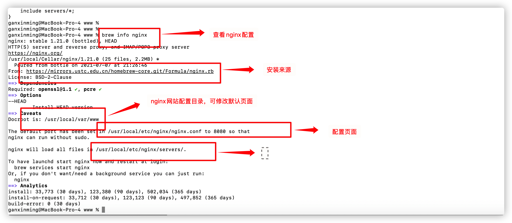
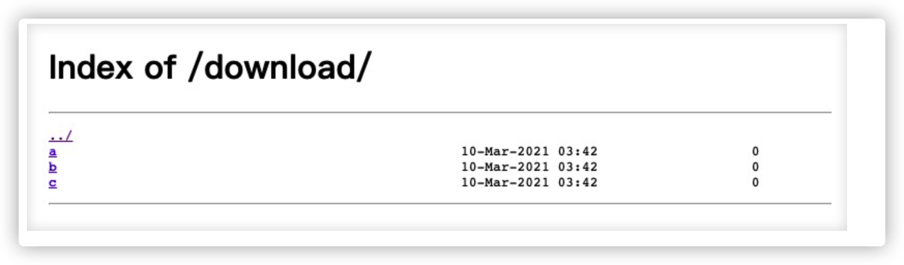
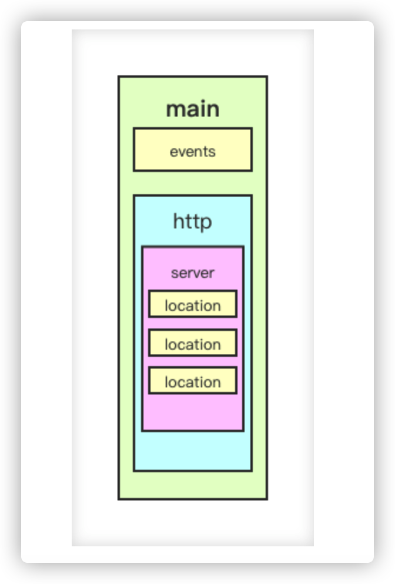

## 安装nginx

brew install nginx

## 查看nginx配置

brew info nginx



## 启动nginx

```bash
找到nginx脚本执行命令
【whereis nginx】
	/usr/local/bin/nginx
启动
【./nginx】 
```

## 停止nginx

```
./nginx -s quit	正常停止
./nginx -s stop	强制停止
./nginx -s reload	启动状态下重新加载配置文件
ps aux|grep nginx	查看nginx进程
```

## 配置文件

/usr/local/etc/nginx/nginx.conf 配置文件

/usr/local/bin/nginx 启动脚本

### 文件实例

```
# main段配置信息
user  nginx;                        # 运行用户，默认即是nginx，可以不进行设置
worker_processes  auto;             # Nginx 进程数，一般设置为和 CPU 核数一样
error_log  /var/log/nginx/error.log warn;   # Nginx 的错误日志存放目录
pid        /var/run/nginx.pid;      # Nginx 服务启动时的 pid 存放位置
# events段配置信息
events {
    use epoll;     # 使用epoll的I/O模型(如果你不知道Nginx该使用哪种轮询方法，会自动选择一个最适合你操作系统的)
    worker_connections 1024;   # 每个进程允许最大并发数，50000+最大理论值，但是一般硬件达不到
}
# http段配置信息
# 配置使用最频繁的部分，代理、缓存、日志定义等绝大多数功能和第三方模块的配置都在这里设置
http { 
    # 设置日志模式
    log_format  main  '$remote_addr - $remote_user [$time_local] "$request" '
                      '$status $body_bytes_sent "$http_referer" '
                      '"$http_user_agent" "$http_x_forwarded_for"';
    access_log  /var/log/nginx/access.log  main;   # Nginx访问日志存放位置
    sendfile            on;   # 开启高效传输模式
    tcp_nopush          on;   # 减少网络报文段的数量
    tcp_nodelay         on;
    keepalive_timeout   65;   # 保持连接的时间，也叫超时时间，单位秒
    types_hash_max_size 2048;
    include             /etc/nginx/mime.types;      # 文件扩展名与类型映射表
    default_type        application/octet-stream;   # 默认文件类型
    include /etc/nginx/conf.d/*.conf;   # 加载子配置项
    # server段配置信息
    server {
        listen       80;       # 配置监听的端口
        server_name  localhost;    # 配置的域名
        # location段配置信息
        location / {
            root   /usr/share/nginx/html;  # 网站根目录
            index  index.html index.htm;   # 默认首页文件
            deny 172.168.22.11;   # 禁止访问的ip地址，可以为all
            allow 172.168.33.44；# 允许访问的ip地址，可以为all
        }
        error_page 500 502 503 504 /50x.html;  # 默认50x对应的访问页面
        error_page 400 404 error.html;   # 同上
    }
    # 反向代理配置
	 upstream server_list{
       		# 这个是tomcat的访问路径
      		 server localhost:8081 weight=1;
      		 server localhost:8082 weight=2;
	}
}
```

- #### `main` 全局配置，对全局生效；

  - ```
    ##指定运行 Nginx 的 woker 子进程的属主和属组，其中组可以不指定。
    user nginx lion; # 用户是nginx;组是lion
    pid /opt/nginx/logs/nginx.pid # master主进程的的pid存放在nginx.pid的文件
    
    ##指定 worker 子进程可以打开的最大文件句柄数。
    worker_rlimit_nofile 20480; # 可以理解成每个worker子进程的最大连接数量。
    
    ##指定 worker 子进程异常终止后的 core 文件，用于记录分析问题。
    worker_rlimit_core 50M; # 存放大小限制
    working_directory /opt/nginx/tmp; # 存放目录
    
    ##指定 Nginx 启动的 worker 子进程数量。
    worker_processes 4; # 指定具体子进程数量
    worker_processes auto; # 与当前cpu物理核心数一致
    
    ##将每个 worker 子进程与我们的 cpu 物理核心绑定。
    worker_cpu_affinity 0001 0010 0100 1000; # 4个物理核心，4个worker子进程
    将每个 worker 子进程与特定 CPU 物理核心绑定，优势在于，避免同一个 worker 子进程在不同的 CPU 核心上切换，缓存失效，降低性能。但其并不能真正的避免进程切换。(算是物理手法实现避免线程切换)
    
    ##指定 worker 子进程优雅退出时的超时时间。
    worker_shutdown_timeout 5s;
    
    ##worker 子进程内部使用的计时器精度，调整时间间隔越大，系统调用越少，有利于性能提升；反之，系统调用越多，性能下降。
    timer_resolution 100ms;
    
    ##指定 Nginx 的运行方式，前台还是后台，前台用于调试，后台用于生产。
    daemon off; # 默认是on，后台运行模式
    
    ```

- #### `events` 配置影响 `Nginx` 服务器与用户的网络连接；

  - ```
    ##Nginx 使用何种事件驱动模型
    use method; # 不推荐配置它，让nginx自己选择
    method 可选值为：select、poll、kqueue、epoll、/dev/poll、eventport
    
    ##worker 子进程能够处理的最大并发连接数。
    worker_connections 1024 # 每个子进程的最大连接数为1024
    
    ##是否打开负载均衡互斥锁。
    accept_mutex on # 默认是off关闭的，这里推荐打开
    
    ```

    

- #### `http` 配置代理，缓存，日志定义等绝大多数功能和第三方模块的配置；

- #### `server` 配置虚拟主机的相关参数(包括资源)，一个 `http` 块中可以有多个 `server` 块；

  - ##### Server_name 指定虚拟主机域名，当访问的域名被匹配时，进入nginx代理。

    - ```
      # 示例：
      server_name www.nginx.com;
      
      匹配优先级：精确匹配 > 左侧通配符匹配 > 右侧通配符匹配 > 正则表达式匹配
      
      # 左匹配
      server {
          listen    80;
          server_name    *.nginx-test.com;
          root    /usr/share/nginx/html/nginx-test/left-match/;
          location / {
              index index.html;
          }
      }
      # 正则匹配
      server {
          listen    80;
          server_name    ~^.*\.nginx-test\..*$;
          root    /usr/share/nginx/html/nginx-test/reg-match/;
          location / {
              index index.html;
          }
      }
      # 右匹配
      server {
          listen    80;
          server_name    www.nginx-test.*;
          root    /usr/share/nginx/html/nginx-test/right-match/;
          location / {
              index index.html;
          }
      }
      # 完全匹配
      server {
          listen    80;
          server_name    www.nginx-test.com;
          root    /usr/share/nginx/html/nginx-test/all-match/;
          location / {
              index index.html;
          }
      }
      ```

  - ##### root指定==静态资源目录==位置(即指定访问静态资源的文件夹，==[注意] `root` 会将定义路径与 `URI` 叠加==)

    ```
    例如：
    location /image {
        root /opt/nginx/static;
    }
    当用户访问 www.test.com/image/1.png 时，实际在服务器找的路径是 /opt/nginx/static/image/1.png
    ```

  - ##### alias(它也是指定静态资源目录位置，它只能写在 `location` 中。)

    ```
    location /image {
        alias /opt/nginx/static/image/;
    }
    当用户访问 www.test.com/image/1.png 时，实际在服务器找的路径是 /opt/nginx/static/image/1.png
    ```

- #### `location` 用于配置匹配的 `uri` ；

  - ```
    配置路径。
    
    location [ = | ~ | ~* | ^~ ] uri {
        ...
    }
    匹配规则：
    
    = 精确匹配；
    ~ 正则匹配，区分大小写；
    ~* 正则匹配，不区分大小写；
    ^~ 匹配到即停止搜索；
    匹配优先级： = > ^~ > ~ > ~* > 不带任何字符。
    
    server {
      listen    80;
      server_name    www.nginx-test.com;
      # 只有当访问 www.nginx-test.com/match_all/ 时才会匹配到/usr/share/nginx/html/match_all/index.html
      location = /match_all/ {
          root    /usr/share/nginx/html
          index index.html
      }
      # 当访问 www.nginx-test.com/1.jpg 等路径时会去 /usr/share/nginx/images/1.jpg 找对应的资源
      location ~ \.(jpeg|jpg|png|svg)$ {
          root /usr/share/nginx/images;
      }
      # 当访问 www.nginx-test.com/bbs/ 时会匹配上 /usr/share/nginx/html/bbs/index.html
      location ^~ /bbs/ {
          root /usr/share/nginx/html;
        index index.html index.htm;
      }
    }
    ```

  - ### return

    停止处理请求，直接返回响应码或重定向到其他 `URL` ；执行 `return` 指令后， `location` 中后续指令将不会被执行。

    ```
    return code [text];
    return code URL;
    return URL;
    例如：
    location / {
        return 404; # 直接返回状态码
    }
    location / {
        return 404 "pages not found"; # 返回状态码 + 一段文本
    }
    location / {
        return 302 /bbs ; # 返回状态码 + 重定向地址
    }
    location / {
        return https://www.baidu.com ; # 返回重定向地址
    }
    ```

  - ## rewrite

    根据指定正则表达式匹配规则，重写 `URL` 。

    ```
    语法：rewrite 正则表达式 要替换的内容 [flag];
    上下文：server、location、if
    示例：rewirte /images/(.*\.jpg)$ /pic/$1; # $1是前面括号(.*\.jpg)的反向引用
    
    flag 可选值的含义：
    
    last 重写后的 URL 发起新请求，再次进入 server 段，重试 location 的中的匹配；
    break 直接使用重写后的 URL ，不再匹配其它 location 中语句；
    redirect 返回302临时重定向；
    permanent 返回301永久重定向；
    
    
    server{
      listen 80;
      server_name fe.lion.club; # 要在本地hosts文件进行配置
      root html;
      location /search {
          rewrite ^/(.*) https://www.baidu.com redirect;
      }
      location /images {
          rewrite /images/(.*) /pics/$1;
      }
      location /pics {
          rewrite /pics/(.*) /photos/$1;
      }
      location /photos {
      }
    }
    
    按照这个配置我们来分析：
    
    当访问 fe.lion.club/search 时，会自动帮我们重定向到 https://www.baidu.com。
    当访问 fe.lion.club/images/1.jpg 时，第一步重写 URL 为 fe.lion.club/pics/1.jpg ，找到 pics 的 location ，继续重写 URL 为 fe.lion.club/photos/1.jpg ，找到 /photos 的 location 后，去 html/photos 目录下寻找 1.jpg 静态资源。
    ```

  - ## if 指令

    ```
    语法：if (condition) {...}
    上下文：server、location
    示例：
    if($http_user_agent ~ Chrome){
      rewrite /(.*)/browser/$1 break;
    }
    
    condition 判断条件：
    
    $variable 仅为变量时，值为空或以0开头字符串都会被当做 false 处理；
    = 或 != 相等或不等；
    ~ 正则匹配；
    ! ~ 非正则匹配；
    ~* 正则匹配，不区分大小写；
    -f 或 ! -f 检测文件存在或不存在；
    -d 或 ! -d 检测目录存在或不存在；
    -e 或 ! -e 检测文件、目录、符号链接等存在或不存在；
    -x 或 ! -x 检测文件可以执行或不可执行；
    
    server {
      listen 8080;
      server_name localhost;
      root html;
      location / {
          if ( $uri = "/images/" ){
            rewrite (.*) /pics/ break;
        }
      }
    }
    当访问 localhost:8080/images/ 时，会进入 if 判断里面执行 rewrite 命令。
    ```

  - ## autoindex(这种直接列出该目录下的文件还是挺常见的）

    用户请求以 `/` 结尾时，列出目录结构，可以用于快速搭建静态资源下载网站。

    ```
    server {
      listen 80;
      server_name fe.lion-test.club;
      location /download/ {
        root /opt/source;
        autoindex on; # 打开 autoindex，，可选参数有 on | off
        autoindex_exact_size on; # 修改为off，以KB、MB、GB显示文件大小，默认为on，以bytes显示出⽂件的确切⼤⼩
        autoindex_format html; # 以html的方式进行格式化，可选参数有 html | json | xml
        autoindex_localtime off; # 显示的⽂件时间为⽂件的服务器时间。默认为off，显示的⽂件时间为GMT时间
      }
    }
    当访问 fe.lion.com/download/ 时，会把服务器 /opt/source/download/ 路径下的文件展示出来，如下图所示：
    
    ```

    

- #### `upstream` 配置后端服务器具体地址，负载均衡配置不可或缺的部分；

  


# 配置常用常量

```
server{
    listen 8081;
    server_name var.lion-test.club;
    root /usr/share/nginx/html;
    location / {
        return 200 "
remote_addr: $remote_addr
remote_port: $remote_port
server_addr: $server_addr
server_port: $server_port
server_protocol: $server_protocol
binary_remote_addr: $binary_remote_addr
connection: $connection
uri: $uri
request_uri: $request_uri
scheme: $scheme
request_method: $request_method
request_length: $request_length
args: $args
arg_pid: $arg_pid
is_args: $is_args
query_string: $query_string
host: $host
http_user_agent: $http_user_agent
http_referer: $http_referer
http_via: $http_via
request_time: $request_time
https: $https
request_filename: $request_filename
document_root: $document_root
";
    }
}


当我们访问 http://var.lion-test.club:8081/test?pid=121414&cid=sadasd 时，由于 Nginx 中写了 return 方法，因此 chrome 浏览器会默认为我们下载一个文件，下面展示的就是下载的文件内容：(可以拿到几乎所有的变量值)

remote_addr: 27.16.220.84
remote_port: 56838
server_addr: 172.17.0.2
server_port: 8081
server_protocol: HTTP/1.1
binary_remote_addr: 茉
connection: 126
uri: /test/
request_uri: /test/?pid=121414&cid=sadasd
scheme: http
request_method: GET
request_length: 518
args: pid=121414&cid=sadasd
arg_pid: 121414
is_args: ?
query_string: pid=121414&cid=sadasd
host: var.lion-test.club
http_user_agent: Mozilla/5.0 (Macintosh; Intel Mac OS X 10_14_0) AppleWebKit/537.36 (KHTML, like Gecko) Chrome/88.0.4324.182 Safari/537.36
http_referer: 
http_via: 
request_time: 0.000
https: 
request_filename: /usr/share/nginx/html/test/
document_root: /usr/share/nginx/html
```

