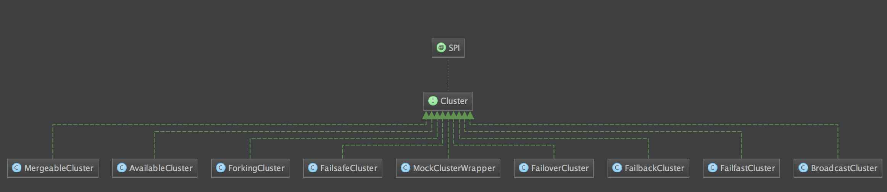

# dubbo-cluster：

看继承体系图中,我们也可以看到了他有9个实现类,换个角度来说,就是有9中应对策略

### MergeableCluster

这个主要用在`分组聚合`中

### 2.AvailableCluster

从单词`Available`意思就知道,这个是调用`可用的`。 遍历所有的`Invokers`判断`invoker.isAvalible`,只要一个有为true直接调用返回，否则就抛出异常

### ForkingCluster

引用官网的介绍

> 并行调用多个服务器，只要一个成功即返回。通常用于实时性要求较高的读操作，但需要浪费更多服务资源。可通过 forks="2" 来设置最大并行数。

底层通过创建线程池，来并发执行

### 4.FailfastCluster

引用官网的介绍

> 快速失败，只发起一次调用，失败立即报错。通常用于非幂等性的写操作，比如新增记录。

就是调用invoke,调用失败就抛出异常

### MockClusterWrapper

这个主要用在`本地伪装`上,让我们来看官网描述

> 本地伪装通常用于服务降级，比如某验权服务，当服务提供方全部挂掉后，客户端不抛出异常，而是通过 Mock 数据返回授权失败

其实就是判断是否开启了本地伪装，如果开启了，且调用异常了，则调用降级方法。

### FailoverCluster

这个是本篇的重点,也是dubbo里面容错方案的缺省值.让我们来看官网介绍

> 失败自动切换，当出现失败，重试其它服务器。通常用于读操作，但重试会带来更长延迟。可通过 retries="2" 来设置重试次数(不含第一次)

也就是说,默认的情况下,如果第一次调用失败,会重试两次,也就是一共是调用三次.所以len = 3的(经过调试确实是3).

那么就有个问题了，读接口使用重复读没关系，如果是写接口，在网络抖动情况下，可能会重复写入很多个值，写接口换成FailfastCluster。

### 7.FailbackCluster

老规矩看官网

> 失败自动恢复，后台记录失败请求，定时重发。通常用于消息通知操作。

### FailsafeCluster

> 失败安全，出现异常时，直接忽略。通常用于写入审计日志等操作。

这个的逻辑就很简单了,官网的这句话就已经介绍完了

### 9.BroadcastCluster

> 广播调用所有提供者，逐个调用，任意一台报错则报错。通常用于通知所有提供者更新缓存或日志等本地资源信息。

这个的逻辑也是很简单,遍历所有`Invokers`, 逐个调用每个调用,有异常就catch,以免影响到剩下的调用,注意和`AvailableCluster`区别

