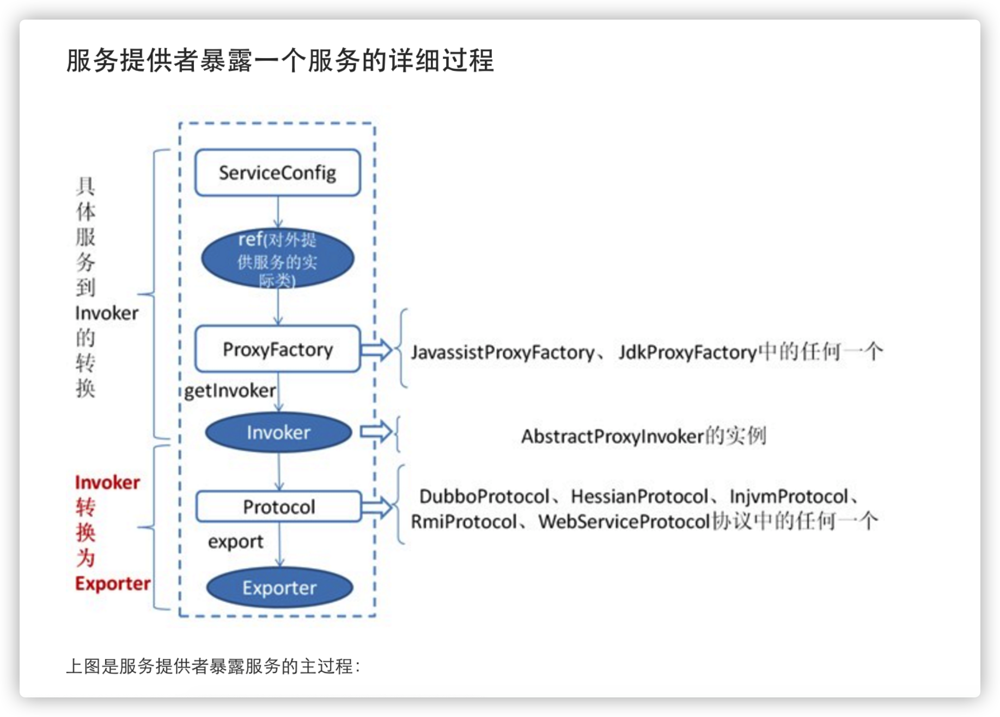
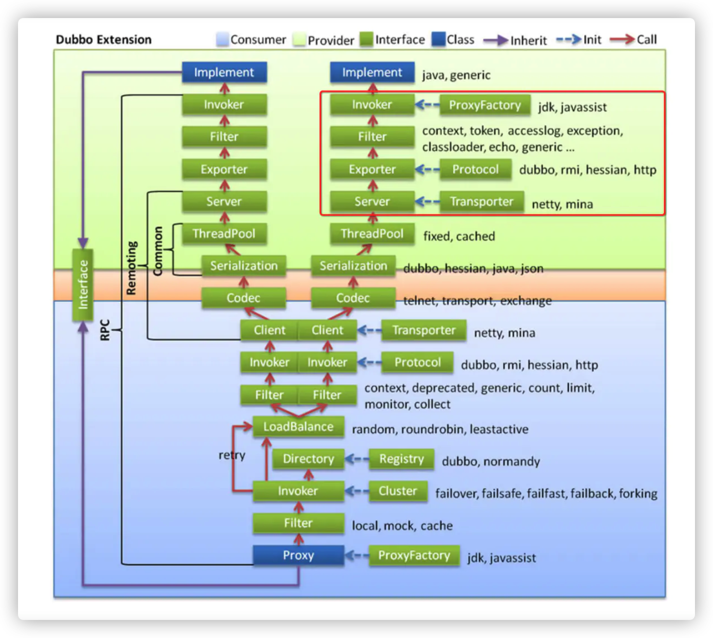

# dubbo服务发布

通过serviceConfig拿到我们需要发布的接口(serviceImpl)，通过proxyFactory(jdk代理或者javassist)将接口转换成invoker(AbstractProxyInvoker实例)，接下来通过protocol(协议，dubbo，hessian等)转换成exporter==暴露==出去

Service->invoker（代理）

Invoker->exporter (暴露)

## 服务暴露：

分为本地暴露和远程暴露。在dubbo中我们一个服务可能既是`Provider`,又是`Consumer`，因此就存在他自己调用自己服务的情况,如果再通过网络去访问,那自然是舍近求远,因此他是有`本地暴露`服务的这个设计.从这里我们就知道这个两者的区别

- 本地暴露是暴露在JVM中,不需要网络通信.
- 远程暴露是将ip,端口等信息暴露给远程客户端,调用时需要网络通信.

本地暴露的url是以`injvm://127.0.0.1`开头的,远程暴露registry://127.0.0..1

