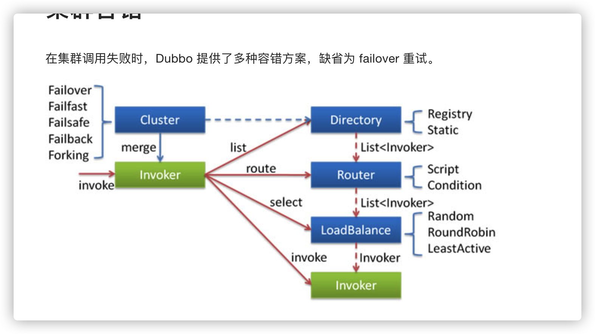

## 一、启动时检查

在服务端注册的时候（客户端注册时同样适用）和客户端引用服务端服务的时候进行检查

```java
<dubbo:registry protocol="zookeeper" address="localhost:2181,localhost:2182,localhost:2183" check="false"/>
  
  <dubbo:reference check="false" id="providerService"
                     interface="com.sihai.dubbo.provider.service.ProviderService"/>
```

## 二、集群容错

dubbo 也是支持集群容错的，同时也有很多可选的方案，其中，默认的方案是 `failover`，也就是重试机制。



|                   |                                                              |                                                          |
| :---------------- | :----------------------------------------------------------- | :------------------------------------------------------- |
| 集群模式          | 说明                                                         | 使用方法                                                 |
| Failover Cluster  | 失败自动切换，当出现失败，重试其它服务器。通常用于读操作，但重试会带来更长延迟。可通过 retries=”2” 来设置重试次数(不含第一次)。 | cluster=”xxx” xxx：集群模式名称 ，例如cluster=”failover” |
| Failfast Cluster  | 快速失败，只发起一次调用，失败立即报错。通常用于非幂等性的写操作，比如新增记录。 |                                                          |
| Failsafe Cluster  | 失败安全，出现异常时，直接忽略。                             |                                                          |
| Failback Cluster  | 失败自动恢复，后台记录失败请求，定时重发。通常用于消息通知操作。 |                                                          |
| Forking Cluster   | 并行调用多个服务器，只要一个成功即返回。通常用于实时性要求较高的读操作，但需要浪费更多服务资源。可通过 forks=”2” 来设置最大并行数。 |                                                          |
| Broadcast Cluster | 广播调用所有提供者，逐个调用，任意一台报错则报错。通常用于通知所有提供者更新缓存或日志等本地资源信息。 |                                                          |

```
<dubbo:service interface="com.springDubbo.dubboService.generic.GenelService"
            ref="genelService" version="1.0.0"  retries="2" cluster="failover"/>
```

原码解析，过程如下(实际上消费者使用provider的接口，是一个代理(jdk))：

- Cluster(==特别重要核心==) 将 Directory 中的多个 Invoker 伪装成一个 Invoker，对上层透明，伪装过程包含了容错逻辑，调用失败后，重试另一个

- 在`Directory`中找出本次集群中的全部`invokers` 

  ==Directory 代表多个 Invoker，可以把它看成 List ,但与 List 不同的是，它的值可能是动态变化的，比如注册中心推送变更==

- 在`Router`中,将上一步的全部`invokers`挑选出能正常执行的`invokers`

  ==条件路由主要就是根据dubbo管理控制台配置的路由规则来过滤相关的`invoker`,当我们对路由规则点击`启用`的时候,就会触发`RegistryDirectory`类的`notify`方法==

- 在`LoadBalance`中,将上一步的能正常的执行`invokers`中,根据配置的负载均衡策略,挑选出需要执行的`invoker`

## 三、负载均衡

在集群负载均衡时，Dubbo 提供了多种均衡策略，缺省为 `random` 随机调用。

| 负载均衡模式               | 说明                                                         | 使用方法                                             |
| :------------------------- | :----------------------------------------------------------- | :--------------------------------------------------- |
| Random LoadBalance         | 随机 按权重设置随机概率                                      | <dubbo:service loadbalance=”xxx”/> xxx：负载均衡方法 |
| RoundRobin LoadBalance     | 轮询 按公约后的权重设置轮询比率。                            |                                                      |
| LeastActive LoadBalance    | 最少活跃调用数 相同活跃数的随机，活跃数指调用前后计数差。    |                                                      |
| ConsistentHash LoadBalance | 一致性 Hash 相同参数的请求总是发到同一提供者。 当某一台提供者挂时，原本发往该提供者的请求，基于虚拟节点，平摊到其它提供者，不会引起剧烈变动。 |                                                      |

## 四、直连提供者dubbo直连

在开发及测试环境下，经常需要绕过注册中心，只测试指定服务提供者，所以，这种情况下，我们只需要直接连接服务端的地即可

```java
<dubbo:reference id="providerService"
                     interface="com.sihai.dubbo.provider.service.ProviderService"
                     url="dubbo://192.168.234.1:20880/com.sihai.dubbo.provider.service.ProviderService"/>
```

## 五、只订阅(即可以连zk查询，但是不能往zk写入数据)

为方便开发测试，经常会在线下共用一个所有服务可用的注册中心，这时，如果一个正在开发中的服务提供者注册，可能会影响消费者不能正常运行。

可以让服务提供者开发方，只订阅服务(开发的服务可能依赖其它服务)，而不注册正在开发的服务，通过直连测试正在开发的服务。

==禁止注册register="false"==

```java
<dubbo:registry register="false" protocol="zookeeper" address="localhost:2181,localhost:2182,localhost:2183" check="false"/>
```

## 六、只注册(即注册上zk，但不对外开发)

如果有两个镜像环境，两个注册中心，有一个服务只在其中一个注册中心有部署，另一个注册中心还没来得及部署，而两个注册中心的其它应用都需要依赖此服务。这个时候，可以让服务提供者方只注册服务到另一注册中心，而不从另一注册中心订阅服务。

只注册正好跟前面的只订阅相反，这个时候可以向注册中心注册，但是，消费端却不能够读到服务。

在服务端的 `dubbo:registry` 节点下使用 `subscribe="false"` 来声明这个服务是只注册的服务

```java
<dubbo:registry id="hzRegistry" address="10.20.153.10:9090" />
<dubbo:registry id="qdRegistry" address="10.20.141.150:9090" subscribe="false" />

```

## 七、多协议机制

Dubbo 允许配置多协议，在不同服务上支持不同协议或者同一服务上同时支持多种协议。

不同服务在性能上适用不同协议进行传输，比如大数据小并发用短连接协议，小数据大并发用长连接协议

```xml
    <dubbo:application name="world"  />
    <dubbo:registry id="registry" address="10.20.141.150:9090" username="admin" password="hello1234" />
    <!-- 多协议配置 -->
    <dubbo:protocol name="dubbo" port="20880" />
    <dubbo:protocol name="rmi" port="1099" />
    <!-- 使用dubbo协议暴露服务 -->
    <dubbo:service interface="com.alibaba.hello.api.HelloService" version="1.0.0" ref="helloService" protocol="dubbo" />
    <!-- 使用rmi协议暴露服务 -->
    <dubbo:service interface="com.alibaba.hello.api.DemoService" version="1.0.0" ref="demoService" protocol="rmi" /> 
```

## 八、多注册中心注册

比如：中文站有些服务来不及在青岛部署，只在杭州部署，而青岛的其它应用需要引用此服务，就可以将服务同时注册到两个注册中心。

(无论是生产者还是消费者，都可以执行注册中心)

```xml
<!-- 多注册中心配置 -->
    <dubbo:registry id="hangzhouRegistry" address="10.20.141.150:9090" />
    <dubbo:registry id="qingdaoRegistry" address="10.20.141.151:9010" default="false" />
    <!-- 向多个注册中心注册 -->
    <dubbo:service interface="com.alibaba.hello.api.HelloService" version="1.0.0" ref="helloService" registry="hangzhouRegistry,qingdaoRegistry" />
```

不同服务注册不同注册中心

```xml
<!-- 多注册中心配置 -->
    <dubbo:registry id="chinaRegistry" address="10.20.141.150:9090" />
    <dubbo:registry id="intlRegistry" address="10.20.154.177:9010" default="false" />
    <!-- 向中文站注册中心注册 -->
    <dubbo:service interface="com.alibaba.hello.api.HelloService" version="1.0.0" ref="helloService" registry="chinaRegistry" />
    <!-- 向国际站注册中心注册 -->
    <dubbo:service interface="com.alibaba.hello.api.DemoService" version="1.0.0" ref="demoService" registry="intlRegistry" />
```

消费者引用

```xml
<!-- 多注册中心配置 -->
    <dubbo:registry id="chinaRegistry" address="10.20.141.150:9090" />
    <dubbo:registry id="intlRegistry" address="10.20.154.177:9010" default="false" />
    <!-- 引用中文站服务 -->
    <dubbo:reference id="chinaHelloService" interface="com.alibaba.hello.api.HelloService" version="1.0.0" registry="chinaRegistry" />
    <!-- 引用国际站站服务 -->
    <dubbo:reference id="intlHelloService" interface="com.alibaba.hello.api.HelloService" version="1.0.0" registry="intlRegistry" />
```

## 九、多版本(不兼容接口时，进行版本过渡)

当一个接口实现，出现不兼容升级时，可以用版本号过渡，版本号不同的服务相互间不引用。

可以按照以下的步骤进行版本迁移：

1. 在低压力时间段，先升级一半提供者为新版本
2. 再将所有消费者升级为新版本
3. 然后将剩下的一半提供者升级为新版本    

       <!-- 机器A提供1.0.0版本服务 -->
        <dubbo:service interface="com.xxx.ProviderService" version="1.0.0" />
        <!-- 机器B提供2.0.0版本服务 -->
        <dubbo:service interface="com.xxx.ProviderService" version="2.0.0" />
   
    <!-- start--服务消费者   -->
    <!-- 机器C消费1.0.0版本服务 -->
    <dubbo:reference id="consumerService" interface="com.xxx.ProviderService" version="1.0.0" />
    <!-- 机器D消费2.0.0版本服务 -->
    <dubbo:reference id="consumerService" interface="com.xxx.ProviderService" version="2.0.0" />
    <!-- 消费任意一个版本服务 -->
    <dubbo:reference id="consumerService" interface="com.xxx.ProviderService" version="*" />

## 十、服务分组(即同一接口不同实现)

比如菜单服务，接口一样，但有多种实现，用group区分


    <!-- 机器A：服务提供者 -->
        <bean id="zhenliangsongA" class="com.xxx.ServiceImplA" />
        <dubbo:service group="song" interface="com.xxx.InterfaceService" ref="zhenliangsongA" />
        <!-- 机器B：服务提供者 -->
        <bean id="zhenliangsongB" class="com.xxx.ServiceImplB" />
        <dubbo:service group="wang" interface="com.xxx.InterfaceService" ref="zhenliangsongB" />
        <!-- end--服务提供者   -->
    
    <!-- start--服务消费者   -->
    <!-- 机器C：服务消费者：dubbo消费者也可以设置为“*”，表示消费任意一个group的服务均可   -->
    <dubbo:reference id="consumerService" interface="com.xxx.InterfaceService" group="*" />
    <!-- 机器D：服务消费者：dubbo消费者也可以设置为“song”，表示只能消费group是song的接口实现类   -->
    <dubbo:reference id="consumerService" interface="com.xxx.InterfaceService" group="song" />
    <!-- 机器E：服务消费者：dubbo消费者也可以设置为“wang”，表示只能消费group是wang的接口实现类   -->
    <dubbo:reference id="consumerService" interface="com.xxx.InterfaceService" group="wang" />
    <!-- end--服务消费者   -->

## 十一、结果缓存

结果缓存，用于加速热门数据的访问速度，Dubbo 提供声明式缓存，以减少用户加缓存的工作量 。(猜测是根据传入的参数来进行缓存结果)缓存类型

- `lru` 基于最近最少使用原则删除多余缓存，保持最热的数据被缓存。
- `threadlocal` 当前线程缓存，比如一个页面渲染，用到很多 portal，每个 portal 都要去查用户信息，通过线程缓存，可以减少这种多余访问。
- `jcache` 与 [JSR107](http://jcp.org/en/jsr/detail?id=107') 集成，可以桥接各种缓存实现。

```xml
<dubbo:reference interface="com.foo.BarService" cache="lru" />
<!--方法级别缓存-->
<dubbo:reference interface="com.foo.BarService">
    <dubbo:method name="findBar" cache="lru" />
</dubbo:reference>
```

## 十二、泛化调用

泛化接口调用方式主要用于客户端没有 API 接口及模型类元的情况，参数及返回值中的所有 POJO 均用 `Map` 表示，通常用于框架集成，比如：实现一个通用的服务测试框架，可通过 `GenericService` 调用所有服务实现。

#### 通过 Spring 使用泛化调用

在 Spring 配置申明 `generic="true"`：

```xml
<dubbo:reference id="barService" interface="com.foo.BarService" generic="true" />
```

在 Java 代码获取 barService 并开始泛化调用：

```java
//因为没有接口类，只能通过名称，用application
GenericService barService = (GenericService) applicationContext.getBean("barService");
Object result = barService.$invoke("sayHello", new String[] { "java.lang.String" }, new Object[] { "World" });
```

但是有个问题，既然没有api，在配置中写的接口名就是纯字符串


# 十三、本地伪装

本地伪装 [1](https://dubbo.apache.org/zh/docs/v2.7/user/examples/local-mock/#fn:1) 通常用于服务降级，比如某验权服务，当服务提供方全部挂掉后，客户端不抛出异常，而是通过 Mock 数据返回授权失败。

在 spring 配置文件中按以下方式配置：

```xml
<dubbo:reference interface="com.foo.BarService" mock="true" />
```

或

```xml
<dubbo:reference interface="com.foo.BarService" mock="com.foo.BarServiceMock" />
```

在工程中提供 Mock 实现 [2](https://dubbo.apache.org/zh/docs/v2.7/user/examples/local-mock/#fn:2)：

```java
package com.foo;
public class BarServiceMock implements BarService {
    public String sayHello(String name) {
        // 你可以伪造容错数据，此方法只在出现RpcException时被执行
        return "容错数据";
    }
}
```

