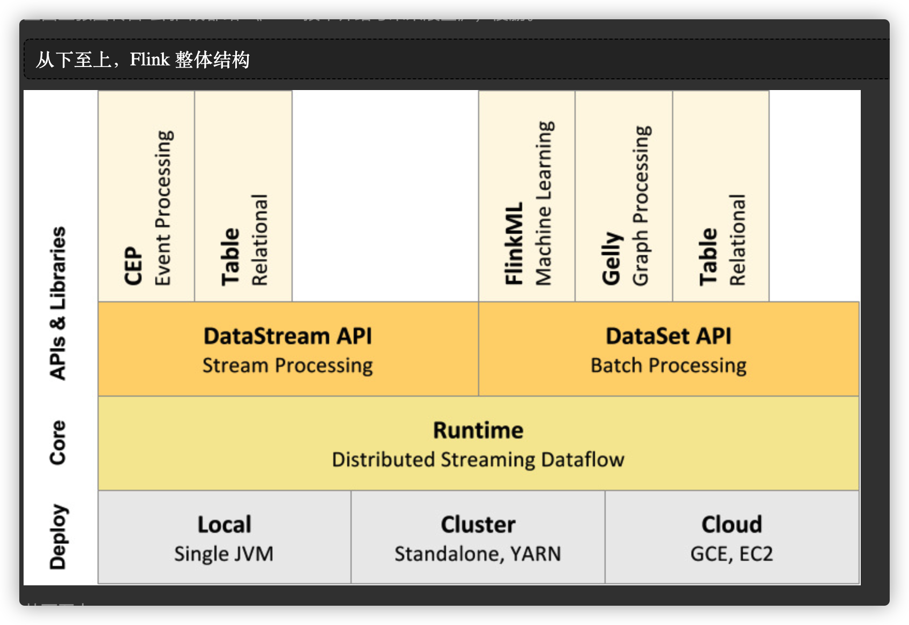
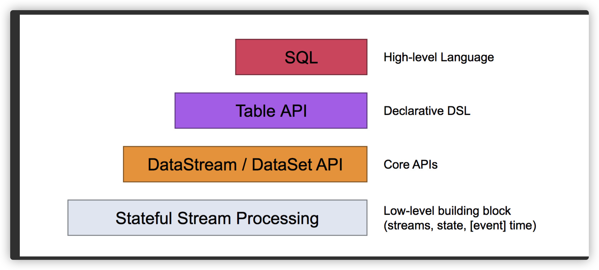
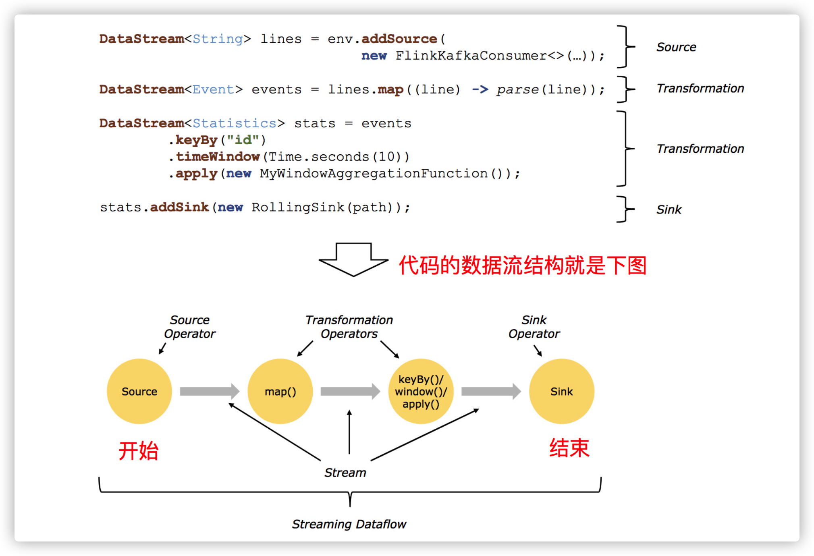
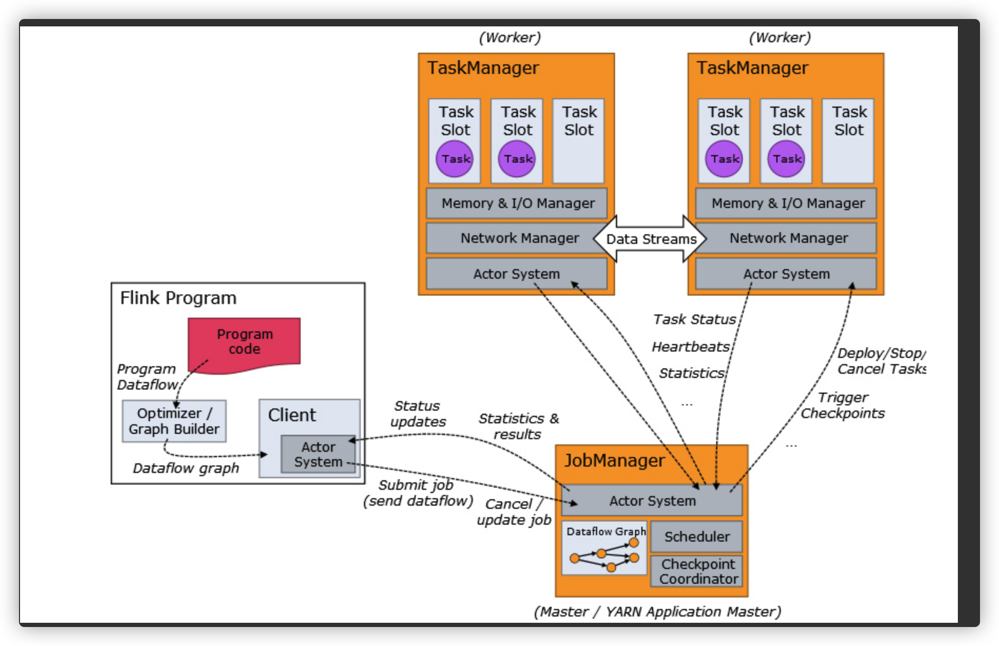
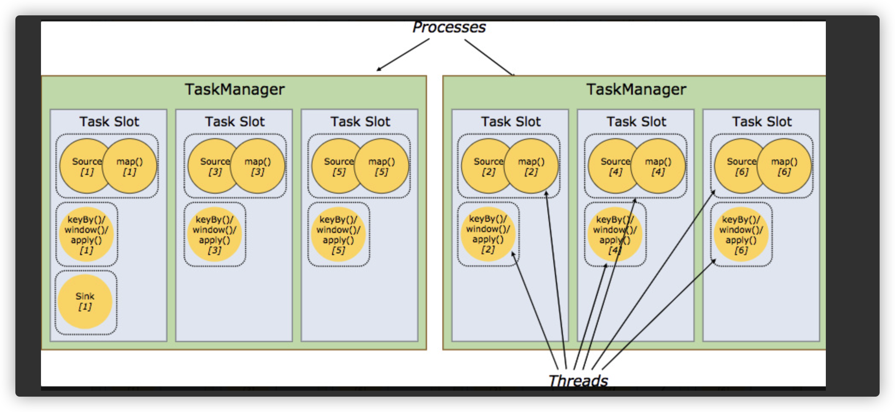

### **Flink是一个分布式的计算处理引擎**

- 分布式：「它的存储或者计算交由**多台服务器上**完成，最后汇总起来达到最终的效果」。
- 实时：处理速度是毫秒级或者秒级的
- 计算：可以简单理解为对数据进行处理，比如清洗数据（对数据进行规整，取出有用的数据）

#### 什么是有边界bounded和无边界unbounded？

> Apache Flink 是一个框架和分布式处理引擎，用于在**_无边界和有边界_数据流**上进行有状态的计算。

`Producer`生产数据，发给`Broker`，`Consumer`消费，完事。

在消费的时候，我们需要管什么Producer什么时候发消息吗？不需要吧。反正来一条，我就处理一条，没毛病吧。

这种没有做任何处理的消息，默认就是**无边界**的。

那有边界就很好理解了：无边界的基础上**加上条件**，那就是有边界的。加什么条件呢？比如我要加个时间：我要消费从8月8号到8月9号的数据，那就是有边界的。

**有边界：批处理**

**无边界：流处理**

##### 在`Flink`上，设置“边界”这种操作叫做开窗口(`Windows`)，窗口可简单分为两种类型：

- 时间窗口(`TimeWindows`)：按照时间窗口进行聚合，比如上面所讲得攥着一个小时的数据处理一次。
- 计数窗口(`CountWindows`)：按照指定的**条数**来进行聚合，比如每来了10条数据处理一次。

#### 各种处理框架流程对比：

MapReduce：input ==》map (reduce) ==> output

Spark： input ==>  transformations  ==> action ==> output

Storm：input ==> spout ==> bolt ==> output

Flink： source == > transformations ==> sink

### 从下至上，Flink 整体结构

1、部署：Flink 支持本地运行、能在独立standAlone集群或者在被 YARN 或 Mesos 管理的集群上运行， 也能部署在云上。

2、运行：Flink 的核心是==分布式流式数据引擎==，意味着数据以一次一个事件的形式被处理。

3、API：DataStream(流)、DataSet(批)、Table、SQL API。

4、扩展库：Flink 还包括用于复杂事件处理，机器学习，图形处理和 Apache Storm 兼容性的专用代码库。

### Flink 数据流编程模型

- 最底层提供了==有状态流==。它将通过 过程函数（**Process Function**）嵌入到 DataStream API 中。它允许用户可以自由地处理来自一个或多个流数据的事件，并使用一致、容错的状态。除此之外，用户可以注册事件时间和处理事件回调，从而使程序可以实现复杂的计算。
- **DataStream** / **DataSet** API 是 Flink 提供的核心 API ，DataSet 处理有界的数据集，DataStream 处理有界或者无界的数据流。用户可以通过各种方法（map / flatmap / window / keyby / sum / max / min / avg / join 等）将数据进行转换 / 计算。
- **Table API** 是以 *表* 为中心的声明式 DSL，其中表可能会动态变化（在表达流数据时）。Table API 提供了例如 select、project、join、group-by、aggregate 等操作，使用起来却更加简洁（代码量更少）。

你可以在表与 *DataStream*/*DataSet* 之间无缝切换，也允许程序将 *Table API* 与 *DataStream* 以及 *DataSet* 混合使用。

- Flink 提供的最高层级的抽象是 **SQL** 。这一层抽象在语法与表达能力上与 *Table API* 类似，但是是以 SQL查询表达式的形式表现程序。SQL 抽象与 Table API 交互密切，同时 SQL 查询可以直接在 Table API 定义的表上执行。

#### Flink 程序与数据流结构

Flink 应用程序结构就是如上图所示：数据源获取->数据清洗->数据sink

1、Source: 数据源，Flink 在流处理和批处理上的 source 大概有 4 类：基于本地集合的 source(基于内存)、基于文件的 source(基于磁盘)、基于网络套接字的 source(基于网络)、自定义的 source(其他类型)。自定义的 source 常见的有 Apache kafka、Amazon Kinesis Streams、RabbitMQ、Twitter Streaming API、Apache NiFi 等，当然你也可以定义自己的 source。

2、Transformation：数据转换的各种操作，有 Map / FlatMap / Filter / KeyBy / Reduce / Fold / Aggregations / Window / WindowAll / Union / Window join / Split / Select / Project 等，操作很多，可以将数据转换计算成你想要的数据。

3、Sink：接收器，Flink 将转换计算后的数据发送的地点 ，你可能需要存储下来，Flink 常见的 Sink 大概有如下几类：写入文件、打印出来、写入 socket 、自定义的 sink 。自定义的 sink 常见的有 Apache kafka、RabbitMQ、MySQL、ElasticSearch、Apache Cassandra、Hadoop FileSystem 等，同理你也可以定义自己的 sink。

### 为什么选择 Flink？

①提供准确的结果，甚至在出现无序或者延迟加载的数据的情况下。

②它是状态化的容错的，同时在维护一次完整的的应用状态时，能无缝修复错误。

③大规模运行，在上千个节点运行时有很好的吞吐量和低延迟。

- Flink 保证状态化计算强一致性。”状态化“意味着应用可以维护随着时间推移已经产生的数据聚合或者，并且 Filnk 的检查点机制在一次失败的事件中一个应用状态的强一致性。

- Flink 支持流式计算和带有事件时间语义的视窗。事件时间机制使得那些事件无序到达甚至延迟到达的数据流能够计算出精确的结果。(即使消息)
- 除了提供数据驱动的视窗外，Flink 还支持基于时间，计数，session 等的灵活视窗。视窗能够用灵活的触发条件定制化从而达到对复杂的流传输模式的支持。Flink 的视窗使得模拟真实的创建数据的环境成为可能。
- Flink 保存点提供了一个状态化的版本机制，使得能以无丢失状态和最短停机时间的方式更新应用或者回退历史数据。
- Flink 的程序内在是并行和分布式的，数据流可以被分区成 **stream partitions**，operators 被划分为operator subtasks; 这些 subtasks 在不同的机器或容器中分不同的线程独立运行；operator subtasks 的数量在具体的 operator 就是并行计算数，程序不同的 operator 阶段可能有不同的并行数；如下图所示，source operator 的并行数为 2，但最后的 sink operator 为1；
- 自己的内存管理
  - Flink 在 JVM 中提供了自己的内存管理，使其独立于 Java 的默认垃圾收集器。 它通过使用散列，索引，缓存和排序有效地进行内存管理。
- 丰富的库
  - Flink 拥有丰富的库来进行机器学习，图形处理，关系数据处理等。 由于其架构，很容易执行复杂的事件处理和警报。

### 分布式运行

1、Program Code：我们编写的 Flink 应用程序代码

2、Job Client：Job Client 不是 Flink 程序执行的内部部分，但它是任务执行的起点。 Job Client 负责接受用户的程序代码，然后创建数据流，将数据流提交给 Job Manager 以便进一步执行。 执行完成后，Job Client 将结果返回给用户。

3、Job Manager：主进程（也称为==作业管理器==）协调和管理程序的执行。 它的主要职责包括安排任务，管理checkpoint ，故障恢复等。机器集群中至少要有一个 master，master 负责调度 task，协调 checkpoints 和容灾，高可用设置的话可以有多个 master，但要保证一个是 leader, 其他是 standby; Job Manager 包含 Actor system、Scheduler、Check pointing 三个重要的组件。

4、Task Manager：从 Job Manager 处接收需要部署的 Task。Task Manager 是在 JVM 中的一个或多个线程中执行任务的工作节点。 任务执行的并行性由每个 Task Manager 上可用的任务槽决定。 每个任务代表分配给任务槽的一组资源。 例如，如果 Task Manager 有四个插槽，那么它将为每个插槽分配 25％ 的内存。 可以在任务槽中运行一个或多个线程。 同一插槽中的线程共享相同的 JVM。 同一 JVM 中的任务共享 TCP 连接和心跳消息。Task Manager 的一个 Slot 代表一个可用线程，该线程具有固定的内存，注意 Slot 只对内存隔离，没有对 CPU 隔离。默认情况下，Flink 允许子任务共享 Slot，即使它们是不同 task 的 subtask，只要它们来自相同的 job。这种共享可以有更好的资源利用率。(==一个Task Manager，可以运行多个任务，包含多个solt，solt代表一个可用线程，一个任务可以多个solt协助。一个solt，内存固定，但是CPU没有隔离。==)

​	