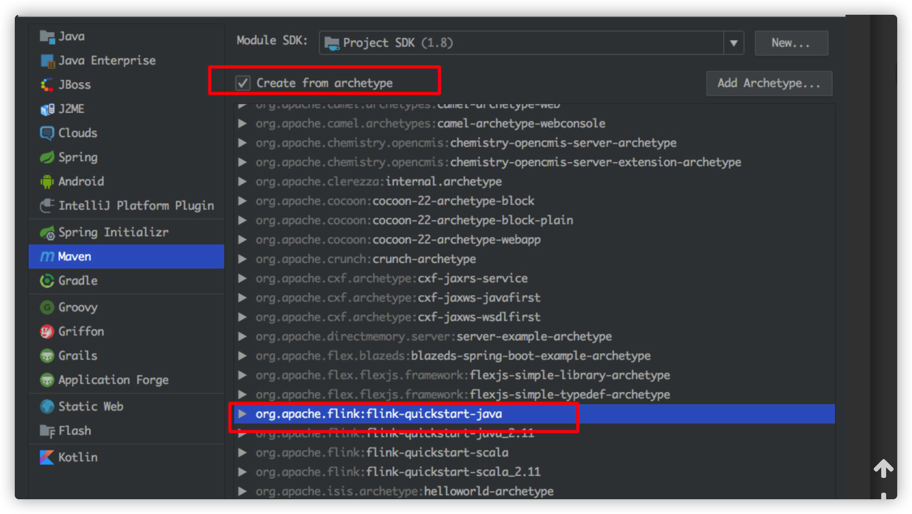

# 安装

macOS

```
brew install apache-flink //安装
flink --version //查看版本

/usr/local/Cellar/apache-flink/1.6.0/libexec/bin  ./start-cluster.sh //启动
Starting cluster.
Starting standalonesession daemon on host zhisheng.
Starting taskexecutor daemon on host zhisheng.


http://localhost:8081/) 查看flink平台


需要记住flink主要目录
/usr/local/Cellar/apache-flink/1.6.0/libexec
```


```
flink run -c org.gan.flink.SocketTextStreamWordCount /Users/ganxinming/myProjects/OurGUT/myFlink/target/myFlink-1.0-SNAPSHOT.jar 127.0.0.1 9000

flink run -c org.gan.flink.SocketTextStreamWordCount  /Users/ganxinming/myProjects/OurGUT/myFlink/target/myFlink-1.0-SNAPSHOT.jar 127.0.0.1 9000
```


## 提交一个Flink任务(所有编写完的main方法，需要提交)

##### 1.新建flink的java任务



##### 2.创建完任务后进行maven打成jar包

```
mvn clean package -Dmaven.test.skip=true
```

##### 3.提交运行的任务

```
flink run -c org.gan.kafka.KafkaUtils /Users/ganxinming/myProjects/OurGUT/myFlink/target/myFlink-1.0-SNAPSHOT.jar 127.0.0.1 9000

flink run -c 类主路径 包地址 127.0.0.1 9000
```

# 界面提交


