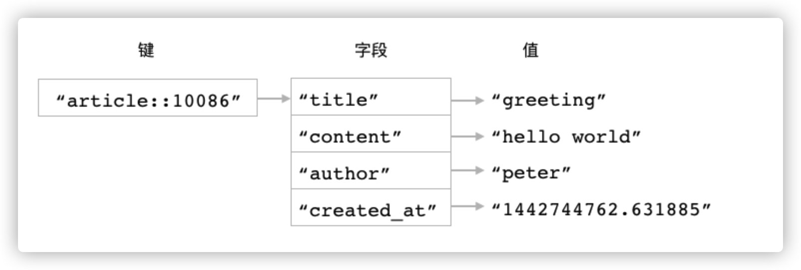

# Hash(散列)

Redis 的散列键会将一个键和一个散列在数据库里面关联起来，用户可以在散列里面为任意多个字段（field）设置值。跟字符串键一样，散列的字段和值既可以是文本数据，也可以是二进制数据。



# 命令

```
1.HSET hash field value(相当于写入和覆盖写入)
如果给定字段并不存在于散列当中，那么这次设置就是一次创建操作，命令将在散列里面关联起给定的字段和值，然后返回 1 。
如果给定的字段原本已经存在于散列里面，那么这次设置就是一次更新操作，命令将使用用户给定的新值去覆盖字段原有的旧值，然后返回 0 。
redis> HSET article::10086 title "greeting"
(integer) 1
redis> HSET article::10086 content "hello world"
(integer) 1
redis> HSET article::10086 content "Redis is a data structure store, ..."
(integer) 0

2.HSETNX hash field value(只会在字段不存在时写入)
HSETNX 命令在字段不存在并且成功为它设置值时返回 1 ，在字段已经存在并导致设置操作未能成功执行时返回 0
redis> HSETNX article::10086 view_count 100
(integer) 1    -- 设置成功
redis> HSETNX article::10086 view_count 200
(integer) 0    -- 设置失败

3.HGET hash field(获取字段)
如果用户给定的字段并不存在于散列当中，那么 HGET 命令将返回一个空值。
redis> HGET article::10086 author
"peter"
redis> HGET account::54321 location
(nil)


```

