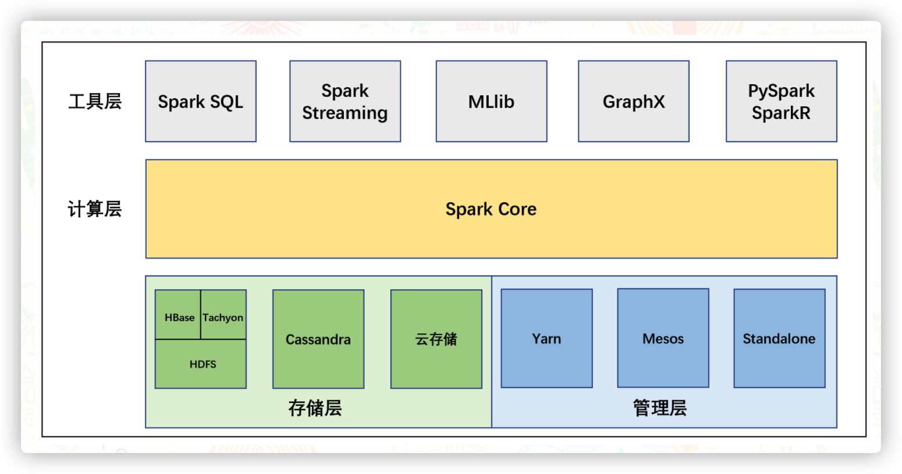
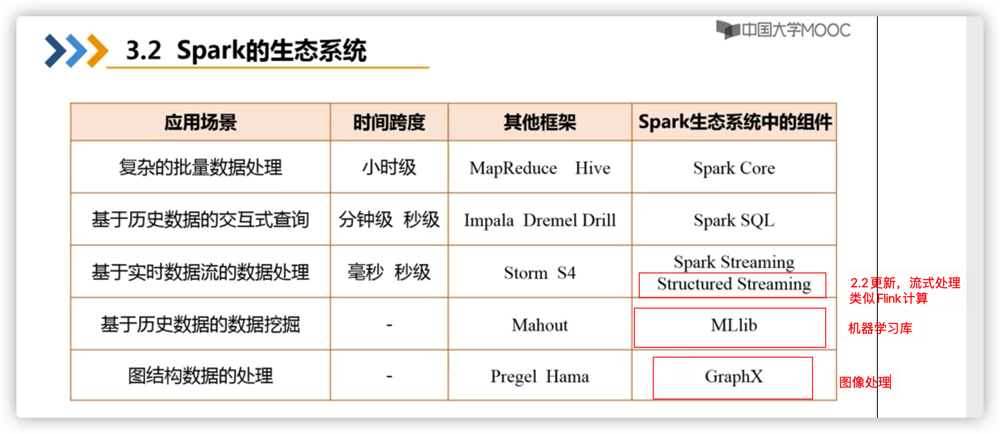

# spark安装

进入Spark官网(https://spark.apache.org/downloads.html)下载spark2.4.8


解压文件，移动到指定的位置并重命名。

```bash
cd ~/Downloads/
# 解压
tar -zvxf spark-3.0.0-preview2-bin-hadoop2.7.tgz
移动到指定的位置并重命名
mv ~/Downloads/spark-3.0.0-preview2-bin-hadoop2.7 /usr/local/spark
```

上述步骤操作完后，开始进行环境变量配置。

1.对于原生终端，环境变量配置方式如下：

```bash
# 打开配置文件
vim ~/.bash_profile
# 在配置文件中添加下面三行代码
export SPARK_HOME=/usr/local/spark
export PATH=$PATH:$SPARK_HOME/bin
export PYSPARK_PYTHON=python3
# 更新配置文件
source ~/.bash_profile
```

2.对于zsh终端，环境变量配置方式如下：

```bash
# 打开配置文件
vim ~/.zshrc
# 在配置文件中添加下面三行代码
export SPARK_HOME=/usr/local/spark
export PATH=$PATH:$SPARK_HOME/bin
export PYSPARK_PYTHON=python3
# 更新配置文件
source ~/.zshrc
```

------

**验证阶段**

首先验证python3版本的spark，输入pyspark，出现如下界面，代表安装成功。


若是使用scala版本的spark，则可以输入spark-shell进行验证出现如下界面代表安装成功。


### 什么是Spark

Apache Spark 是专为大规模数据处理而设计的快速通用的计算引擎。

Spark是一个快速的，多用途的集群计算系统，相对于Hadoop来说Spark只是一个计算框架，它不包含Hadoop的分布式文件系统HDFS和完备的调度系统YARN，它与Hadoop的MapReduce对比在计算性能和效率上有大幅度提升，而且Spark为数据计算提供了丰富的api封装，可以减少编程的复杂度提高编程效率。Hadoop的MapReduce在计算过程中是将中间结果存储在文件系统中，而Spark在计算的过程中是将中间结果存储在内存中，可以将数据在不写入硬盘的情况下在内存中进行计算，这也是Spark运行速度效率远超Hadoop MapReduce的主要原因。

(1.hadoop的MapReduce是将中间结果储存磁盘，spark储存内存。2.spark运行速度远快于hadoop)

### Spark有什么特点

Spark是一个分布式计算引擎，它支持多种语言的API，其计算节点可以拓展到成千上万个，它能够在内存中进行数据集缓存实现交互式数据分析，同时它也提供了shell命令行交互窗口，为探索式数据分析节省时间。其具体特点，我们从以下四个方面简单列出

#### 快速

- Spark在内存时的计算速度大概是Hadoop的100倍
- Spark基于硬盘的计算速度大概是Hadoop的10倍
- Spark的DAG执行引擎，其数据缓存在内存中可以进行迭代处理，Spark使用先进的DAG（Directed Acyclic Graph，有向无环图）执行引擎，以支持循环数据流与内存计算，基于内存的执行速度可比Hadoop MapReduce快上百倍，基于磁盘的执行速度也能快十倍；

#### 易用

- Spark支持Java、Scala、Python、R、SQL等多种语言API
- Spark支持多种高级运算API使得用户可以轻松开发、构建和运行计算程序
- Spark可以使用基于Scala、Python、R、SQL的shell交互式查询

#### 通用

- Spark提供了一个完整的技术栈，包括SQL执行，Dataset命令式API，机器学习库MLlib，图计算框架GraphX，流计算SparkStreaming
- 用户可以在同一个应用中同时使用多种Spark的技术

#### 兼容

- Spark可以运行在Hadoop Yarn，Apache Mesos，Kubernets，Spark Standalone等集群之中
- Spark可以访问HBase、HDFS、Hive、Cassandra等多种数据源

## Spark相对于Hadoop的优势

Hadoop虽然已成为大数据技术的事实标准，但其本身还存在诸多缺陷，最主要的缺陷是其MapReduce计算模型延迟过高，无法胜任实时、快速计算的需求，因而只适用于离线批处理的应用场景。
回顾Hadoop的工作流程，可以发现Hadoop存在如下一些缺点：
 ==表达能力有限==。计算都必须要转化成Map和Reduce两个操作，但这并不适合所有的情况，难以描述复杂的数据处理过程；
 ==磁盘IO开销大==。每次执行时都需要从磁盘读取数据，并且在计算完成后需要将中间结果写入到磁盘中，IO开销较大；
 延迟高。一次计算可能需要分解成一系列按顺序执行的MapReduce任务，任务之间的衔接由于涉及到IO开销，会产生较高延迟。而且，在前一个任务执行完成之前，其他任务无法开始，难以胜任复杂、多阶段的计算任务。
Spark在借鉴Hadoop MapReduce优点的同时，很好地解决了MapReduce所面临的问题。相比于MapReduce，Spark主要具有如下优点：

-  Spark的计算模式也属于MapReduce，但不局限于Map和Reduce操作，还提供了多种数据集操作类型，编程模型比MapReduce更灵活；(==多种数据集操作，不限于map，reduce操作==)
- Spark提供了内存计算，中间结果直接放到内存中，带来了更高的迭代运算效率；(==内存存放中间结果==)
- Spark基于DAG的任务调度执行机制，要优于MapReduce的迭代执行机制。(==DAG任务调度，优于mapreduce==)


Spark最大的特点就是将计算数据、中间结果都存储在内存中，大大减少了IO开销，因而，Spark更适合于迭代运算比较多的数据挖掘与机器学习运算。使用Hadoop进行迭代计算非常耗资源，因为每次迭代都需要从磁盘中写入、读取中间数据，IO开销大。而Spark将数据载入内存后，之后的迭代计算都可以直接使用内存中的中间结果作运算，避免了从磁盘中频繁读取数据。

尽管Spark相对于Hadoop而言具有较大优势，==但Spark并不能完全替代Hadoop==，主要用于替代Hadoop中的MapReduce计算模型。实际上，Spark已经很好地融入了Hadoop生态圈，并成为其中的重要一员，它可以借助于YARN实现资源调度管理，借助于HDFS实现分布式存储。此外，Hadoop可以使用廉价的、异构的机器来做分布式存储与计算，但是，Spark对硬件的要求稍高一些，对内存与CPU有一定的要求。

### Spark主要组成

Spark提供了批处理，结构化查询，流计算，图计算，机器学习等组件，这些组件都依托于通用的计算引擎RDD，它们之间的关系结构如图所示



#### Spark Core和弹性分布式数据集(RDD)

- Spark Core是整个Spark的基础，包含Spark的基本功能，如内存计算、任务调度、部署模式、故障恢复、存储管理等。提供了分布式任务调度和基本的I/O功能(==分布式调度和IO==)
- Spark建立在统一的抽象RDD之上，使其可以以基本一致的方式应对不同的大数据处理场景；通常所说的Apache Spark，就是指Spark Core，Spark的基础的程序抽象是弹性分布式数据集RDD，==它是一个可以并行操作，支持容错的数据集合==
- RDD可以通过引用外部存储系统的数据集创建创建，也可以通过现有的RDD转换得到
- RDD抽象提供了Java、Scala、Python等语言的API
- RDD简化了编程的复杂性，操作RDD类似通过Scala或者Java8的Streaming操作本地数据集合

#### Spark SQL

- Spark SQL在Spark Core的基础上提出了DataSet和DataFrame的数据抽象化概念
- Spark SQL提供了在DataSet和DataFrame之上执行SQL的能力
- Spark SQL提供了DSL，可以通过Scala、Java、Python等语言操作DataSet和DataFrame
- 支持使用JDBC和ODBC操作SQL语言
- Spark SQL允许开发人员直接处理RDD，同时也可查询Hive、HBase等外部数据源。Spark SQL的一个重要特点是其能够统一处理关系表和RDD，使得开发人员可以轻松地使用SQL命令进行查询，并进行更复杂的数据分析；

#### Spark Streaming

- Spark Streaming充分利用Spark Core的快速开发能力来运行流式分析
- Spark Streaming截取小批量的数据并可以对之运行RDD Transformation
- Spark Streaming提供了在同一个程序中同时使用流分析和批量处理分析的能力
- Spark Streaming支持高吞吐量、可容错处理的实时流数据处理，其核心思路是将流式计算分解成一系列短小的批处理作业。Spark Streaming支持多种数据输入源，如Kafka、Flume和TCP套接字等；



### 二、Spark集群

### Spark的运行方式

Spark部署模式主要有四种：Local模式（单机模式）、Standalone模式（使用Spark自带的简单集群管理器）、YARN模式（使用YARN作为集群管理器）和Mesos模式（使用Mesos作为集群管理器）。

先来了解几个名词：

- 集群：一组协同工作的计算机，分工合作对外表现的向一台计算机一样，所有运行的任务有软件来控制和调度
- 集群管理工具：调度任务到集群的软件
- 常见的集群管理工具有：Hadoop YARN，Apache Mesos，Kubernetes

Spark 的运行模式大方向分为两种：

- 单机：使用线程模拟并行运行的程序
- 集群，使用集群管理器来和不同类型的集群交互，将任务运行在集群中

Spark Standalone模式下几个名词概念

- Master：负责总控，调度，管理和协调Worker，保留资源状况等
- Worker：用于启动Executor执行Tasks，定期向Master汇报
- Driver：运行在Client或者Worker中，负责创建基础环境和任务分配

Spark在集群模式下的支持的管理方式分两个方向：

- Spark自带集群管理器:Spark Standalone

> 在Standalone集群中，分为两个角色Master和Worker，在Standalone集群启动的时候会创建固定数量的Worker。
> Driver的启动分为两种模式：Client和Cluster，在Client模式下，Driver运行在Client端，在Client启动的时候被启动，在Cluster模式下，Driver运行在某个Worker中，随着应用的提交而启动

- 第三方集群管理器：Hadoop YARN，Apache Mesos，Kubernetes

> 在Yarn集群模式下运行Spark程序，首先会和RM交互，开启ApplicationMaster，其中运行了Driver，Driver创建基础环境后，会由RM提供对应的容器，运行Executor，Executor会再向Driver注册自己，并申请Task执行


# 运行简单Demo

spark本次运行根目录：/usr/local/spark

#### 1.mac开启SSH

```
$ sudo launchctl load -w /System/Library/LaunchDaemons/ssh.plist //开启SSH
```

#### 2.开启spark

```
sbin/start-all.sh //开启spark
sbin/stop-all.sh //关闭spark
```

### 3.运行demo【Spark自带的一个演示程序：蒙特卡洛算法求圆周率】

```
#进入Spark安装目录
cd {SPARK_HOME}

bin/spark-submit \
--class org.apache.spark.examples.SparkPi \
--master spark://node-1:7077 \
--executor-memory 1G \
--total-executor-cores 2 \
examples/jars/spark-examples_2.12-3.0.3.jar \
20

bin/spark-submit \
–class org.apache.spark.examples.SparkPi \
–master spark://node01:7077 \
–executor-memory 1G \
–total-executor-cores 1 \
examples/jars/spark-examples_2.12-3.0.3.jar \
10
```