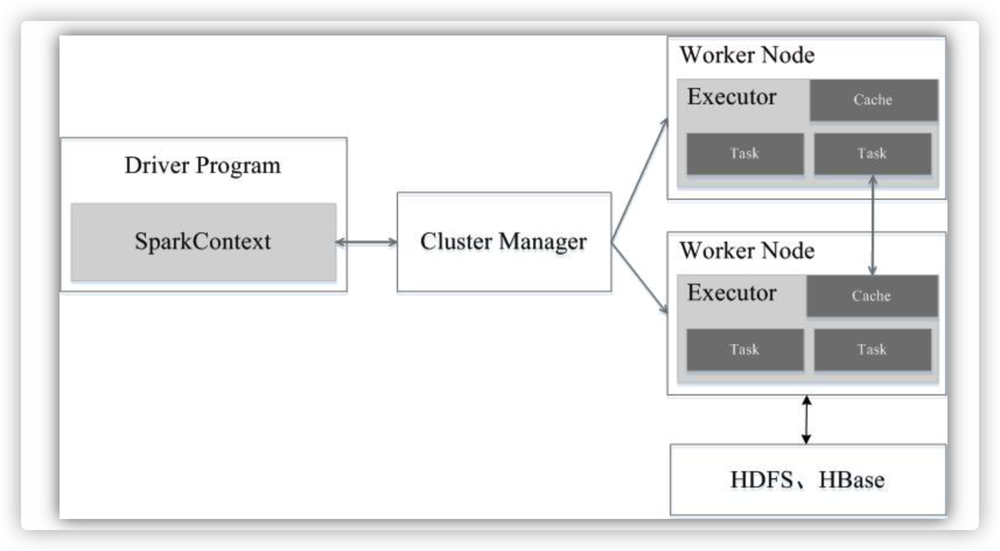
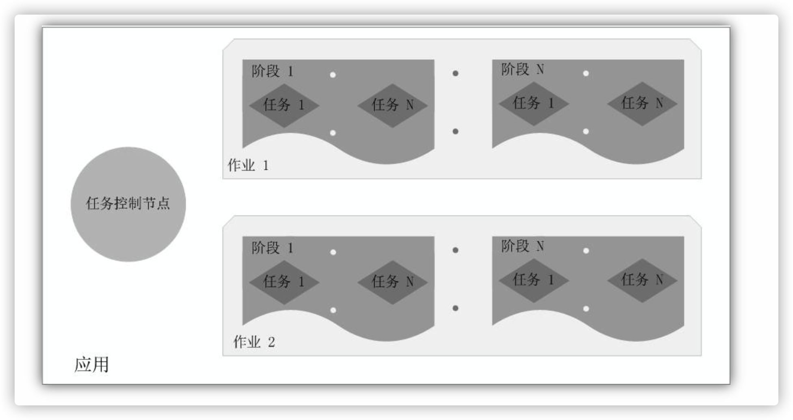
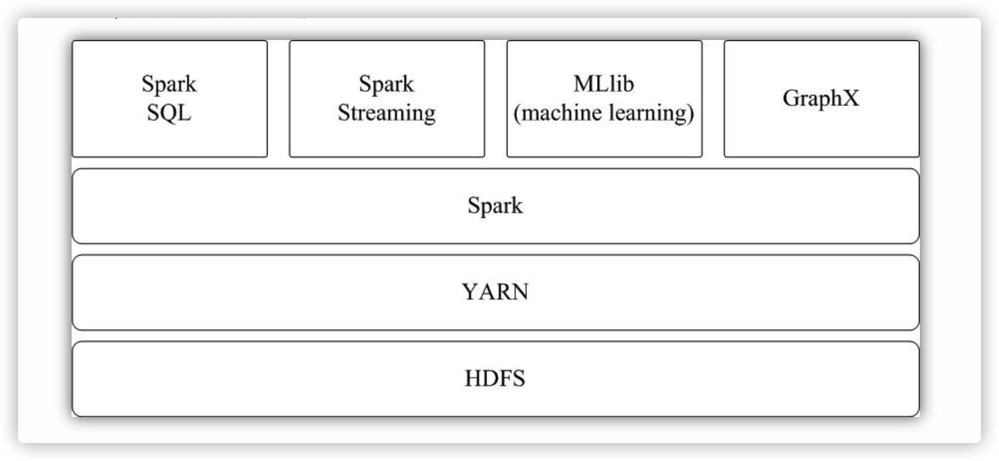

## 基本概念

在具体讲解Spark运行架构之前，需要先了解几个重要的概念：
\*  RDD：==是弹性分布式数据集==（Resilient Distributed Dataset）的简称，是分布式内存的一个抽象概念，提供了一种高度受限的共享内存模型；
\*  DAG：是Directed Acyclic Graph（有向无环图）的简称，反映RDD之间的依赖关系；
\*  Executor：是运行在工作节点（Worker Node）上的一个进程，负责运行任务，并为应用程序存储数据；
\*  应用：用户编写的Spark应用程序；
\*  任务：运行在Executor上的工作单元；
\*  作业：一个作业包含多个RDD及作用于相应RDD上的各种操作；
\*  阶段：是作业的基本调度单位，一个作业会分为多组任务，每组任务被称为“阶段”，或者也被称为“任务集”。

## 架构设计

Spark运行架构包括集群资源管理器（Cluster Manager）、运行作业任务的工作节点（Worker Node）、每个应用的任务控制节点（Driver）和每个工作节点上负责具体任务的执行进程（Executor）。其中，集群资源管理器可以是Spark自带的资源管理器，也可以是YARN或Mesos等资源管理框架。
与Hadoop MapReduce计算框架相比，

Spark所采用的Executor有两个优点：一是利用多线程来执行具体的任务（Hadoop MapReduce采用的是进程模型），减少任务的启动开销；二是Executor中有一个BlockManager存储模块，会将内存和磁盘共同作为存储设备，当需要多轮迭代计算时，可以将中间结果存储到这个存储模块里，下次需要时，就可以直接读该存储模块里的数据，而不需要读写到HDFS等文件系统里，因而有效减少了IO开销；或者在交互式查询场景下，预先将表缓存到该存储系统上，从而可以提高读写IO性能。

总体而言，在Spark中，一个应用（Application）由一个任务控制节点（Driver）和若干个作业（Job）构成，一个作业由多个阶段（Stage）构成，一个阶段由多个任务（Task）组成。当执行一个应用时，任务控制节点会向集群管理器（Cluster Manager）申请资源，启动Executor，并向Executor发送应用程序代码和文件，然后在Executor上执行任务，运行结束后，执行结果会返回给任务控制节点，或者写到HDFS或者其他数据库中。

## Spark运行基本流程

1）当一个Spark应用被提交时，首先需要为这个应用构建起基本的运行环境，即由任务控制节点（Driver）创建一个SparkContext，由SparkContext负责和资源管理器（Cluster Manager）的通信以及进行资源的申请、任务的分配和监控等。SparkContext会向资源管理器注册并申请运行Executor的资源；
（2）资源管理器为Executor分配资源，并启动Executor进程，Executor运行情况将随着“心跳”发送到资源管理器上；
（3）SparkContext根据RDD的依赖关系构建DAG图，DAG图提交给DAG调度器（DAGScheduler）进行解析，将DAG图分解成多个“阶段”（每个阶段都是一个任务集），并且计算出各个阶段之间的依赖关系，然后把一个个“任务集”提交给底层的任务调度器（TaskScheduler）进行处理；Executor向SparkContext申请任务，任务调度器将任务分发给Executor运行，同时，SparkContext将应用程序代码发放给Executor；
（4）任务在Executor上运行，把执行结果反馈给任务调度器，然后反馈给DAG调度器，运行完毕后写入数据并释放所有资源。

### 总结：

1.driver创建SparkContext

2.SparkContext向clusterManager进行资源申请

3.clusterManager分配完资源和对应Executor建立心跳通信

4.SparkContext根据RDD依赖关系构建DAG，然后将这些流程分解成多个阶段，根据依赖关系，交给TaskScheduler任务调度器

5.Executor去TaskScheduler申请任务，TaskScheduler确定任务给Executor执行，然后SparkContext会给具体执行代码

6.Executor执行完毕，将结果反馈TaskScheduler，然后反馈DAG，最后释放资源

总体而言，Spark运行架构具有以下特点：
（1）每个应用都有自己专属的Executor进程，并且该进程在应用运行期间一直驻留。==Executor进程以多线程的方式运行任务==，减少了多进程任务频繁的启动开销，使得任务执行变得非常高效和可靠；
（2）Spark运行过程与资源管理器无关，只要能够获取Executor进程并保持通信即可(==即保持Executor心跳，证明还活着==)；
（3）Executor上有一个BlockManager存储模块，类似于键值存储系统（==把内存和磁盘共同作为存储设备==），在处理迭代计算任务时，不需要把中间结果写入到HDFS等文件系统，而是直接放在这个存储系统上，后续有需要时就可以直接读取；在交互式查询场景下，也可以把表提前缓存到这个存储系统上，提高读写IO性能；(==中间结果放BlockManager==)
（4）任务采用了数据本地性和推测执行等优化机制。数据本地性是尽量将计算移到数据所在的节点上进行，即“计算向数据靠拢”，因为移动计算比移动数据所占的网络资源要少得多。而且，Spark采用了延时调度机制，可以在更大的程度上实现执行过程优化。比如，拥有数据的节点当前正被其他的任务占用，那么，在这种情况下是否需要将数据移动到其他的空闲节点呢？答案是不一定。因为，如果经过预测发现当前节点结束当前任务的时间要比移动数据的时间还要少，那么，调度就会等待，直到当前节点可用。

# Spark部署

Spark应用程序在集群上部署运行时，可以由不同的组件为其提供资源管理调度服务（资源包括CPU、内存等）。比如，可以使用自带的独立集群管理器（standalone），或者使用YARN，也可以使用Mesos。因此，Spark包括三种不同类型的集群部署方式，包括standalone、Spark on Mesos和Spark on YARN。
1.standalone模式
与MapReduce1.0框架类似，Spark框架本身也自带了完整的资源调度管理服务，可以独立部署到一个集群中，而不需要依赖其他系统来为其提供资源管理调度服务。在架构的设计上，Spark与MapReduce1.0完全一致，都是由一个Master和若干个Slave构成，并且以槽（slot）作为资源分配单位。不同的是，Spark中的槽不再像MapReduce1.0那样分为Map 槽和Reduce槽，而是只设计了统一的一种槽提供给各种任务来使用。
2.Spark on Mesos模式
Mesos是一种资源调度管理框架，可以为运行在它上面的Spark提供服务。Spark on Mesos模式中，Spark程序所需要的各种资源，都由Mesos负责调度。由于Mesos和Spark存在一定的血缘关系，因此，Spark这个框架在进行设计开发的时候，就充分考虑到了对Mesos的充分支持，因此，相对而言，Spark运行在Mesos上，要比运行在YARN上更加灵活、自然。目前，Spark官方推荐采用这种模式，所以，许多公司在实际应用中也采用该模式。
3. Spark on YARN模式
Spark可运行于YARN之上，与Hadoop进行统一部署，即“Spark on YARN”，其架构如图9-13所示，资源管理和调度依赖YARN，分布式存储则依赖HDFS。

