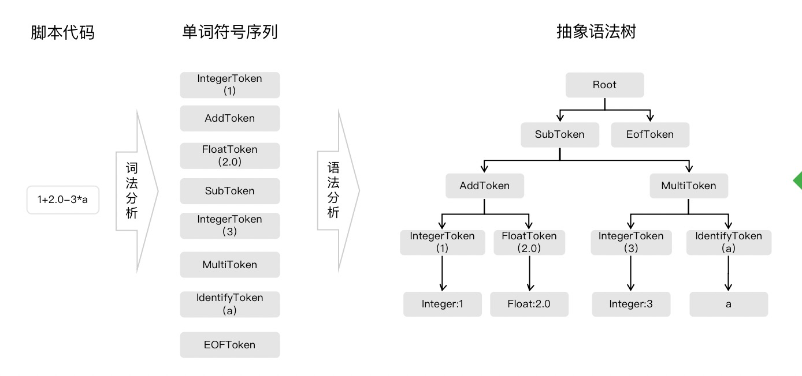
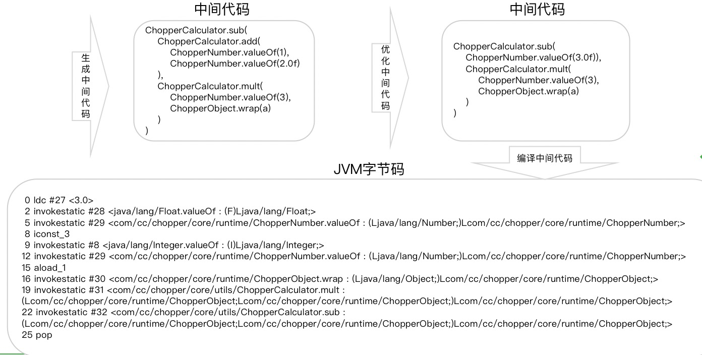

## 脚本语言

1.无需编译即可执行的命令，为缩短传统的编译-链接-运行的过程。

## 脚本引擎

1.有了脚本，当然需要有脚本引擎去进行解释，它将脚本语言翻译成可执行的子程序，一行一行地执行。

# 特性

- 解释运行 ，无需耗时的编译/打包过程。
- 依赖解释器或特定运行环境才能运行。
- 以文本形式存在，类似交互式命令和批量命令。
- 动态运行，支持运行时编写程序并运行。
- 松散的类型定义，完全没有类型声明。
- 语法简洁，功能强大，开发效率高。

## 运行原理

#### 脚本引擎一般分为两种

#### 1.解释型：

程序被一句一句的翻译成脚本解释器的子程序，依赖脚本解释器才能运行。例如Apache Jexl脚本被翻译成Jexl内置方法，再执行这些方法。

#### 流程：

#### 词法分析器

根据词法规则，将脚本代码识别、分类(值token，运算token)并标记为单词符号序列（Token）。

#### 语法分析器

根据语法规则，将单词符号序列进行语法分析并构建语法结构，通常是抽象语法树（Abstract Syntax Tree，AST）。

#### 解释执行器

对抽象语法树进行遍历，将各类单词符号序列翻译成对应的子程序并执行。遍历语法树的过程即是在运行脚本，根节点值即脚本运行结果。

#### 编译型：

程序在运行时被整体编译成目标代码直接运行，不会被翻译成方法函数。例如Groovy脚本语言，运行时被编译成JVM字节码，动态加载运行。

#### 词法分析器

根据语法规则，将脚本代码识别、分类并标记为单词符号序列（Token）。

#### 语法分析器

根据语法规则，将单词符号序列进行分析并构建语法结构，通常是抽象语法树（Abstract Syntax Tree，AST）。

#### 代码生成器

对抽象语法树进行自顶向下后续递归遍历，遍历时将各类单词符号序列翻译成中间代码。

#### 代码优化器

对生成的中间代码进行优化，使其空间占用更少、运行效率更高。

#### 编译器

程序运行时，编译器将中间代码动态等价编译成可执行的目标代码。

#### 执行器

执行器动态加载目标代码到运行环境，并执行目标代码得到结果。

