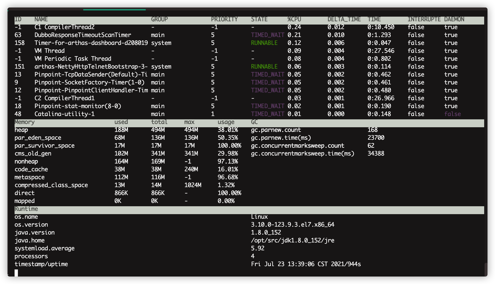
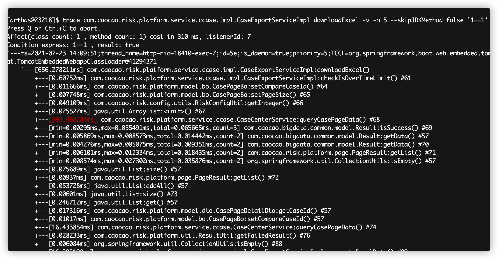
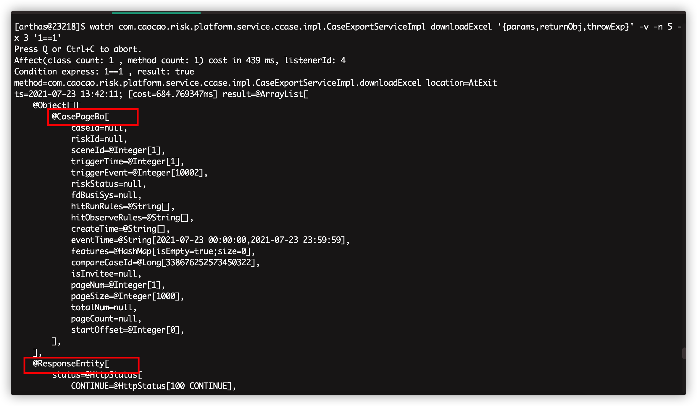
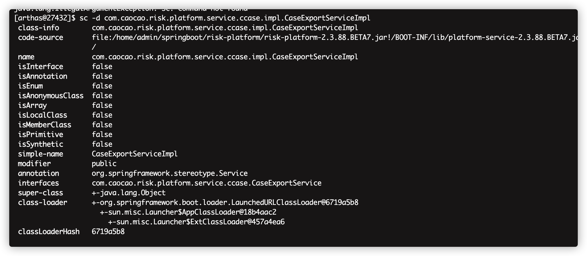
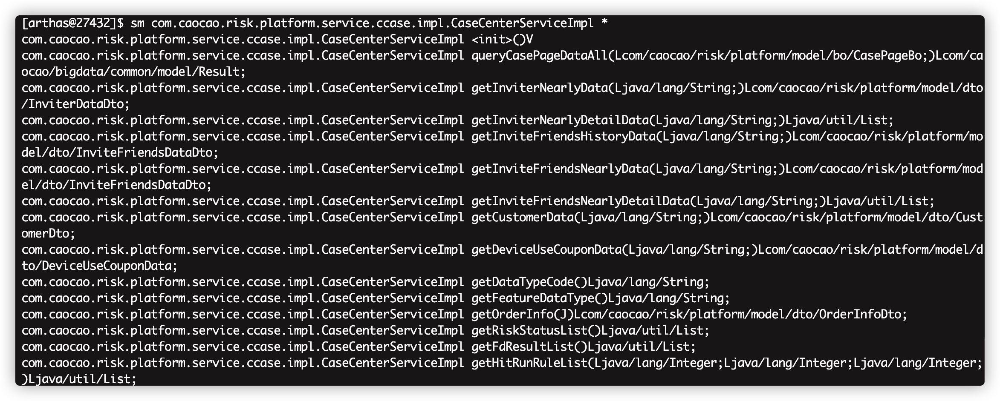

# Arthas入门

1.安装

```
curl -L https://arthas.aliyun.com/install.sh | sh
```

2.安装后

**./as.sh**  进入交互界面 或者http://127.0.0.1:8563 访问界面

**quit**  退出交互界面


## 或者直接java -jar arthas-boot.jar


# 基本命令


	

> ### dashboard数据看板：实时描述线程，内存，系统信息
>
> 命令：dashboard
>
> 

> ### Trace调用耗时：能展示调用方法路径所有耗时(神技)
>
> 命令格式：(此方法两个方法)
>
> trace -E com.caocao.risk.platform.service.ccase.impl.CaseExportServiceImpl|com.caocao.risk.platform.service.ccase.impl.CaseCenterServiceImpl downloadExcel|queryCasePageData -n 5 -v --skipJDKMethod false '1==1'
>
> 

> ### stack方法栈：能查看指定方法的所有栈信息(所有方法，无需调用)

> ### Tt数据时空隧道：记录下每次的调用记录，便于统一观察

> ### Wath方法观察：观察方法的执行成功失败，传入参数，返回参数(只能看到类型和大小)
>
> 命令格式：
>
> watch com.caocao.risk.platform.service.ccase.impl.CaseExportServiceImpl downloadExcel '{params,returnObj,throwExp}' -v -n 5 -x 3 '1==1'




> ### Monitor：记录下每次的调用记录，主要是从大局分析成功和失败的比例，已经平均请求时间（和tt类似）

> ### Jad：反编译源码

> ### Sc：搜索所有加载的类  Sm：搜索所有加载的方法
>
> SC:
>
> 可以指定加载的某个类信息：sc -d com.caocao.risk.platform.service.ccase.impl.CaseExportServiceImpl
>
> 搜索某个包下所有类信息：  sc -d com.caocao.risk.platform.service.ccase.impl.*
>
> 
>
> SM:
>
> 搜索类下的所有方法：   sm com.caocao.risk.platform.service.ccase.impl.CaseCenterServiceImpl *
>
> 

> ### Thead：查看阻塞，吃cpu前几的线程(神技)
>
> thread -n

> ### Ognl：能直接调用方法，类，属性等(神技)

> ### spring各种方法：在IDEA插件中，有各种查看spring类，属性，配置等(绝顶神技)

