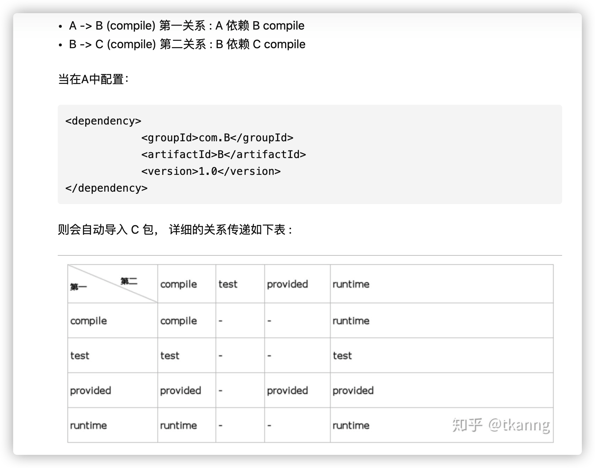

# 版本后缀含义

各类架包名，Maven的依赖，官网API时，常见，GA、SNAP-SHOT、RELEASE、ALPHA、BETA、RC等版本号。

## Alpha、Beta、Gamma版本

如下三者，在系统、架包、软件的开发过程当中，使用。
Alpha：内测版，BUG多，开发人员开发过程当中使用，希腊字母α，第一，指最第一版
Beta：早期版本，有缺陷，无大BUG，可能加入新功能，进一步开发完善。
Gamma: 经beta 版，完善修改，成为正式发布的候选版本（Release Candidate） svg

## RC、GA、R版本

RC：(Release Candidate)：候选版本，几乎就是正式版了，
GA：（Ggeneral Availability）：发行稳定版，官方推荐使用此版本。
R，RELEASE：正式版，等价于GA测试

## SNAPSHOT版本

- SNAPSHOT：快照版，能够稳定使用，且仍在继续改进版本。

- 举个例子：快照版本和正式版本的主要区别在于，本地获取这些依赖的机制有所不同。假设你依赖一个库的正式版本，构建的时候构建工具会先在本次仓库中查找是否已经有了这个依赖库，如果没有的话才会去远程仓库中去拉取。所以假设你发布了Junit-4.10.jar到了远程仓库，有一个项目依赖了这个库，它第一次构建的时候会把该库从远程仓库中下载到本地仓库缓存，以后再次构建都不会去访问远程仓库了。所以如果你修改了代码，向远程仓库中发布了新的软件包，但仍然叫Junit-4.10.jar，那么依赖这个库的项目就无法得到最新更新。你只有在重新发布的时候升级版本，比如叫做Junit-4.11.jar，然后通知依赖该库的项目组也修改依赖版本为Junit-4.11,这样才能使用到你最新添加的功能。

- 配置Maven的Repository的时候中有个配置项，可以配置对于SNAPSHOT版本向远程仓库中查找的频率。频率共有四种，分别是always、daily、interval、never。当本地仓库中存在需要的依赖项目时，always是每次都去远程仓库查看是否有更新，daily是只在第一次的时候查看是否有更新，当天的其它时候则不会查看；interval允许设置一个分钟为单位的间隔时间，在这个间隔时间内只会去远程仓库中查找一次，never是不会去远程仓库中查找（这种就和正式版本的行为一样了）。

  ```
  <repository>
      <id>myRepository</id>
      <url>...</url>
      <snapshots>
          <enabled>true</enabled>
          <updatePolicy>always</updatePolicy>
      </snapshots>
  </repository>
  ```

- 简而言之：SNAPSHOT版本更新了代码，打包后，会被调用者更新。而其他版本必须升级一个版本号才能被调用者更新，而且如果不升级版本号，连包都可能打不进仓库(即使打进了，调用者也不会更新)。


#### Maven定义了几种依赖关系，分别是`compile`、`test`、`runtime`和`provided`和system：

##### system

从参与度来说，也provided相同，不过被依赖项不会从maven仓库抓，而是从本地文件系统拿，一定需**要配合systemPath属性使用**。

| scope    | 说明                                          | 示例            |
| :------- | :-------------------------------------------- | :-------------- |
| compile  | 编译时，运行时需要用到该jar包（默认）         | commons-logging |
| test     | 编译Test时需要用到该jar包                     | junit           |
| runtime  | 编译时不需要，但运行时需要用到                | mysql           |
| provided | 编译时需要用到，但运行时由JDK或某个服务器提供 | servlet-api     |


# 依赖传递



## 依赖调节

依赖调解遵循以下两大原则：路径最短优先、声明顺序优先，

- 第一原则：**路径最近者优先**。 把当前模块当作顶层模块，直接依赖的包则作为次层模块，间接依赖的包则作为次层模块的次层模块，依次递推...，最后构成一棵引用依赖树。假设当前模块是A，两种依赖路径如下所示：

```text
A --> B --> X(1.1)         // dist(A->X) = 2
A --> C --> D --> X(1.0)   // dist(A->X) = 3
```

此时，Maven可以按照第一原则自动调解依赖，结果是使用X(1.1)作为依赖。

- 第二原则：**第一声明者优先**。若冲突依赖的路径长度相同，那么第一原则就无法起作用了。 假设当前模块是A，两种依赖路径如下所示：

```text
A --> B --> X(1.1)   // dist(A->X) = 2 
A --> C --> X(1.0)   // dist(A->X) = 2
```

当路径长度相同，则需要根据A直接依赖包在pom文件中的先后顺序来判定使用那条依赖路径，如果次级模块相同则向下级模块推，直至可以判断先后位置为止。

```text
<!-- A pom.xml -->
<dependencies>
    ...
    dependency B
    ...
    dependency C
</dependencies>
```

假设依赖B位置在依赖C之前，则最终会选择X(1.1)依赖。

- 其它情况：**覆盖策略**。若相同类型但版本不同的依赖存在于同一个pom文件，依赖调解两大原则都不起作用，需要采用覆盖策略来调解依赖冲突，最终会引入最后一个声明的依赖。

```text
<!-- 该pom文件最终引入commons-cli:commons-cli:1.3.jar依赖包。 -->

<dependencies>
  <dependency>
    <groupId>commons-cli</groupId>
    <artifactId>commons-cli</artifactId>
    <version>1.2</version>
  </dependency>
  <dependency>
    <groupId>commons-cli</groupId>
    <artifactId>commons-cli</artifactId>
    <version>1.4</version>
  </dependency>
  <dependency>
    <groupId>commons-cli</groupId>
    <artifactId>commons-cli</artifactId>
    <version>1.3</version>
  </dependency>
</dependencies>
```

