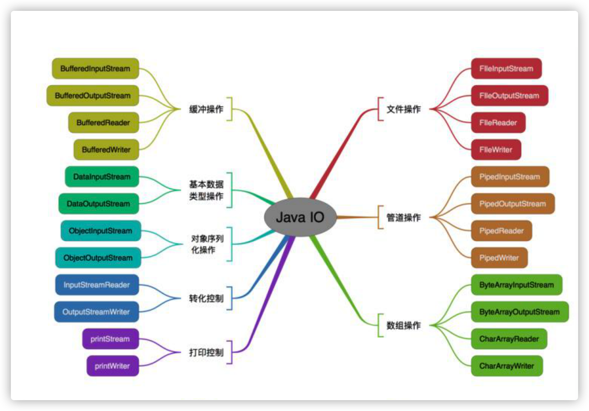

[TOC]

### **八种基本数据类型的大小，以及他们的封装类**

**基本类型 大小（字节） 默认值 封装类**

byte 1 (byte)0 Byte

short 2 (short)0 Short

int 4 0 Integer

long 8 0L Long

flfloat 4 0.0f Float

double 8 0.0d Double

boolean - false Boolean

char 2 \u0000(null) Character

基本数据类型在声明时系统会自动给它分配空间，而引用类型声明时只是分配了引用空间，

必须通过实例化开辟数据空间之后才可以赋值。数组对象也是一个引用对象，将一个数组赋值给另

一个数组时只是复制了一个引用，所以通过某一个数组所做的修改在另一个数组中也看的见。

## Java自动装箱与拆箱

装箱就是自动将基本数据类型转换为包装器类型Integer**valueOf(int)** **方法**

拆箱就是自动将包装器类型转换为基本数据类型调用方法：Integer的intValue方法

在通过valueOf方法创建Integer对象的时候，如果数值在[-128,127]之间，

便返回指向IntegerCache.cache中已经存在的对象的引用；否则创建一个新的Integer对象。

(但是浮点数，是没有缓存的，也就是说double和float没有这个范围内的缓存)

## 重写

 1.发生在父类与子类之间 2.方法名，参数列表相同，返回类型（除过子类中方法的返回类型

是父类中返回类型的子类） 3.访问修饰符的限制一定要大于被重写方法的访问修饰符

（public>protected>default>private) 4.重写方法一定不能抛出新的检查异常或者比被重写方法申

明更加宽泛的检查型异常

## 重载

在一个类中，同名的方法如果有不同的参数列表（**参数类型不同、参数个数不同甚至是参数顺序不**

**同**）则视为重载。同时，重载对返回类型没有要求，可以相同也可以不同，但**不能通过返回类型是**

**否相同来判断重载**。

### **String，String StringBuffffer**和StringBuilder** 的区别是什么

String是只读字符串，它并不是基本数据类型，而是一个对象。从底层源码来看是一个fifinal类型的

字符数组，所引用的字符串不能被改变，一经定义，无法再增删改。每次对String的操作都会生成

新的String对象。

每次+操作 ： 隐式在堆上new了一个跟原字符串相同的StringBuilder对象，再调用append方法 拼 

接+后面的字符。

 StringBuffffer 对方法加了同步锁或者对调用的方法加了同步锁，所

以是线程安全的。StringBuilder 并没有对方法进行加同步锁，所以是非线程安全的。

##  Collection包结构，与Collections的区别

Collection是集合类的上级接口，子接口有 Set、List、LinkedList、ArrayList、Vector、Stack、

Set；Collections是集合类的一个帮助类， 它包含有各种有关集合操作的静态多态方法，用于实现对各种

集合的搜索、排序、线程安全化等操作。此类不能实例化，就像一个工具类，服务于Java的

Collection框架。

# Java创建对象有几种方式？

new创建新对象

通过反射机制

采用clone机制

通过序列化机制

## 有没有可能两个不相等的对象有相同的hashcode

有可能.在产生hash冲突时,两个不相等的对象就会有相同的 hashcode 值.当hash冲突产生时,一般

有以下几种方式来处理:

- 拉链法:每个哈希表节点都有一个next指针,多个哈希表节点可以用next指针构成一个单向链表，被分配到同一个索引上的多个节点可以用这个单向链表进行存储.
- 开放定址法:一旦发生了冲突,就去寻找下一个空的散列地址,只要散列表足够大,空的散列地址总能找到,并将记录存入
- 再哈希:又叫双哈希法,有多个不同的Hash函数.当发生冲突时,使用第二个,第三个….等哈希函数计算地址,直到无冲突.

# final有哪些用法?

- 被fifinal修饰的类不可以被继承
- 被fifinal修饰的方法不可以被重写
- 被fifinal修饰的变量不可以被改变.如果修饰引用,那么表示引用不可变,引用指向的内容可变. 
- 被fifinal修饰的方法,JVM会尝试将其内联,以提高运行效率(如果指定了一个类为final，则该类所有的方法都是final的。Java编译器会寻找机会内联所有的final方法，内联对于提升Java运行效率作用重大)
- 被fifinal修饰的常量,在编译阶段会存入常量池中.（编译期间就可以把这些内容放入常量池中）

## 3*0.1 == 0.3返回值是什么

false,因为有些浮点数不能完全精确的表示出来.

## a=a+b与a+=b有什么区别吗?

+= 操作符会进行隐式自动类型转换,此处a+=b隐式的将加操作的结果类型强制转换为持有结果的类

型,而a=a+b则不会自动进行类型转换.如：

short s1= 1;

s1 = s1 + 1;

有错误.short类型在进行运算时会自动提升为int类型,也就是说 s1+1 的运算结果是int类型,而s1是

short类型,此时编译器会报错.

## try catch finally，try里有return，finally还执行么？

执行，并且fifinally的执行早于try里面的return结论：

1、不管有木有出现异常，fifinally块中代码都会执行；

2、当try和catch中有return时，fifinally仍然会执行；

3、fifinally是在return后面的表达式运算后执行的（此时并没有返回运算后的值，而是先把要返回的

值保存起来，管fifinally中的代码怎么样，返回的值都不会改变，任然是之前保存的值），所以函数

返回值是在fifinally执行前确定的；

4、fifinally中最好不要包含return，否则程序会提前退出，返回值不是try或catch中保存的返回值。

#  Excption与Error包结构

Java可抛出(Throwable)的结构分为三种类型：被检查的异常(CheckedException)，运行时异常

(RuntimeException)，错误(Error)。

### **运行时异常**

定义:RuntimeException及其子类都被称为运行时异常。

特点:Java编译器不会检查它。也就是说，当程序中可能出现这类异常时，倘若既"没有通过throws

声明抛出它"，也"没有用try-catch语句捕获它"，还是会编译通过。

fail-fast机制产生的ConcurrentModifificationException异常（java.util包下面的所有的集合类都是快速失败

的，“快速失败”也就是fail-fast，它是Java集合的一种错误检测机制。==当多个线程对集合进行结构上的改变的操作时==，有可能会产生fail-fast机制。记住是有可能，而不是一定。例如：假设存在两个线程（线程1、线程2），线程1通过Iterator在遍历集合A中的元素，在某个时候线程2修改了集合A的结构（是结构上面的修改，而不是简单的修改集合元素的内容），那么这个时候程序就会抛出ConcurrentModifificationException 异常，从而产生fail-fast机制，这个错叫并发修改异常。

常见的五种运行时异常：

ClassCastException（类转换异常）

IndexOutOfBoundsException（数组越界）

NullPointerException（空指针异常）

ArrayStoreException（数据存储异常，操作数组是类型不一致）

### **被检查异常**

定义:Exception类本身，以及Exception的子类中除了"运行时异常"之外的其它子类都属于被检查异

常。

特点 : Java编译器会检查它。 此类异常，要么通过throws进行声明抛出，要么通过try-catch进行捕

获处理，否则不能通过编译。如：

IOException

FileNotFoundException

SQLException

### **错误**

定义 : Error类及其子类。

特点 : 和运行时异常一样，编译器也不会对错误进行检查。

当资源不足、约束失败、或是其它程序无法继续运行的条件发生时，就产生错误。程序本身无法修

复这些错误的。例如，VirtualMachineError就属于错误。出现这种错误会导致程序终止运行。

OutOfMemoryError、ThreadDeath。

## OOM你遇到过哪些情况，SOF你遇到过哪些情况

### **OOM**： 

1，OutOfMemoryError异常

除了程序计数器外，虚拟机内存的其他几个运行时区域都有发生OutOfMemoryError(OOM)异常的

可能。

Java Heap 溢出：

一般的异常信息：java.lang.OutOfMemoryError:Java heap spacess。java堆用于存储对象实例，我们只要不断的创建对象，并且保证GC Roots到对象之间有可达路径来避免垃圾回收机制清除这些对象，就会在对象数量达到最大堆容量限制后产生内存溢出异常。

出现这种异常，一般手段是先通过内存映像分析工具(如Eclipse Memory Analyzer)对dump出来的

堆转存快照进行分析，重点是确认内存中的对象是否是必要的，==先分清是因为内存泄漏(MemoryLeak)还是内存溢出(Memory Overflflow)。==

#### 内存泄露：(避免回收对象和GCroot关联)

可进一步通过工具查看泄漏对象到GCRoots的引用链。于是就能找到泄漏对象是通过怎样的路径与GC Roots相关联并导致垃圾收集器无法自动回收，想办法回收，减少和GCroot的关联。

#### 内存溢出：(检查参数)

如果不存在泄漏，那就应该检查虚拟机的参数(-Xmx与-Xms)的设置是否适当。

#### 2，虚拟机栈和本地方法栈溢出

如果线程请求的栈深度大于虚拟机所允许的最大深度，将抛出StackOverflflowError异常。

如果虚拟机在扩展栈时无法申请到足够的内存空间，则抛出OutOfMemoryError异常

这里需要注意当栈的大小越大可分配的线程数就越少。

#### 3，运行时常量池溢出(调整方法区大小)

异常信息：java.lang.OutOfMemoryError:PermGenspace

如果要向运行时常量池中添加内容，最简单的做法就是使用String.intern()这个Native方法。该方法

的作用是：如果池中已经包含一个等于此String的字符串，则返回代表池中这个字符串的String对

象；否则，将此String对象包含的字符串添加到常量池中，并且返回此String对象的引用。由于常量

池分配在方法区内，我们可以通过-XX:PermSize和-XX:MaxPermSize限制方法区的大小，从而间接

限制其中常量池的容量。

#### 4，方法区溢出(可能是创建了大量的class，应该注意)

方法区用于存放Class的相关信息，如类名、访问修饰符、常量池、字段描述、方法描述等。也有可

能是方法区中保存的class对象没有被及时回收掉或者class信息占用的内存超过了我们配置。

异常信息：java.lang.OutOfMemoryError:PermGenspace

方法区溢出也是一种常见的内存溢出异常，一个类如果要被垃圾收集器回收，判定条件是很苛刻

的。在经常动态生成大量Class的应用中，要特别注意这点。

## SOF

StackOverflflowError 的定义：当应用程序递归太深而发生堆栈溢出时，抛出该错误。

因为栈一般默认为1-2m，一旦出现死循环或者是大量的递归调用，在不断的压栈过程中，造成栈容

量超过1m而导致溢出。栈溢出的原因：递归调用，大量循环或死循环，全局变量是否过多，数组、List、map数据过大。

# java的IO流

# 反射

## **定义：**

反射机制是在运行时，对于任意一个类，都能够知道这个类的所有属性和方法；对于任意个对象，都能够调用它的任意一个方法。在java中，只要给定类的名字，就可以通过反射机制来获得类的所有信息。

==这种动态获取的信息以及动态调用对象的方法的功能称为Java语言的反射机制。==

**反射的实现方式：**

1）Class.forName(“类的路径”)；

 2）类名.class 

3）对象名.getClass() 

# java所有常用对象面经

## HashMap

#### 特点：

- 由**数组**和**链表(长度>8，变红黑树)**组合构成的数据结构
- 初始容量 16，负载因子0.75，扩容增量：原容量的 1 倍
- 键和值位置都可以是null，但是键位置只能是一个null
- 阈值（边界值）>8并且数组长度大于64，才将链表转换成红黑树，变成红黑树的目的是提高搜索速度，高效查询

#### 工作流程：

HashMap 底层是 hash 数组和单向链表实现，数组中的每个元素都是链表，由 Node 内部类（实现 Map.Entry接口）实现，HashMap 通过 put & get 方法存储和获取。

**存储对象时，将 K/V 键值传给 put() 方法：**

1. 调用 hash(K) 方法计算 K 的 hash 值，然后结合数组长度，计算得数组下标；

2. 调整数组大小（当容器中的元素个数大于 capacity * loadfactor 时，容器会进行扩容resize 为 2n）；

3. 比对hash

4. - 如果 K 的 hash 值在 HashMap 中不存在，则执行插入，若存在，则发生碰撞；
   - 如果 K 的 hash 值在 HashMap 中存在，且它们两者 equals 返回 true，则更新键值对；
   - 如果 K 的 hash 值在 HashMap 中存在，且它们两者 equals 返回 false，则插入链表的尾部（尾插法）或者红黑树中（树的添加方式）。

**获取对象时，将 K 传给 get() 方法：**

1. 调用 hash(K) 方法（计算 K 的 hash 值）从而获取该键值所在链表的数组下标；
2. 顺序遍历链表，equals()方法查找相同 Node 链表中 K 值对应的 V 值。

hashCode 是定位的，存储位置；equals是定性的，比较两者是否相等。

##### 为什么使用红黑树？

1.链表的查找效率O(n),红黑树时间复杂度logn，提升查询效率。

- ==当链表超过8且数组长度(数据总量)超过64才会转为红黑树==
- 将链表转换成红黑树前会判断，如果当前数组的长度小于64，那么会选择先进行数组扩容，而不是转换为红黑树，以减少搜索时间。

##### 链表插入方法：

1.8之前：头插法,(考虑后插入的是用的较多的元素，对速度有提示）

1.8后：尾插法(头插法可能出现链表成环的情况，改成尾插法)

##### 传入数组大小：

不一定是指定的数组大小，一般都是2的幂。比如传入6，数组大小是8，2的三次方。

#### 解决Hash冲突方法有：

开放定址法、再哈希法、链地址法（HashMap中常见的拉链法）、简历公共溢出区。HashMap中采用的是链地址法。

#### 哈希表底层采用何种算法计算hash值？还有哪些算法可以计算出hash值？

hashCode方法是Object中的方法，所有的类都可以对其进行使用，首先底层通过调用hashCode方法生成初始hash值h1，然后将h1无符号右移16位得到h2，之后将h1与h2进行按位异或（^）运算得到最终hash值h3，之后将h3与(length-1)进行按位与（&）运算得到hash表索引。

（==1.hashcode高16和低16位异或 2.和hashcode长度-1进行与操作==）

##### 这样hash作用：

1.减少冲突

2.提升运算时间

其他可以计算出hash值的算法有

- 平方取中法
- 取余数
- 伪随机数法

## ArrayList

ArrayList就是[数组](https://so.csdn.net/so/search?q=数组&spm=1001.2101.3001.7020)列表，主要用来装载数据。它的主要底层实现是数组Object[] elementData。相比于[LinkedList](https://so.csdn.net/so/search?q=LinkedList&spm=1001.2101.3001.7020)，它的**特点**为：查询效率⾼，增删效率低，线程不安全。使⽤频率很⾼。

#### 为啥线程不安全还使用他呢？

因为我们正常使⽤的场景中，都是⽤来查询，不会涉及太频繁的增删，如果涉及频繁的增删，可以使⽤LinkedList，如果你需要线程安全就使⽤Vector，这就是三者的区别了，实际开发过程中还是ArrayList使⽤最多的。

#### 既然底层实现是数组，但是数组的大小是定长的，如果我们不断的往里面添加数据的话，不会有问题吗？

ArrayList可以通过构造方法在初始化的时候指定底层数组的大小。
通过⽆参构造方法的方式ArrayList()初始化，则赋值底层数Object[] elementData为⼀个默认空数组，数组容量为0，只有真正对数据进⾏添加add时，才分配默认DEFAULT_CAPACITY = 10的初始容量。(==默认是0，add时才是10==)增：

#### 扩容

他有指定index新增，也有直接新增的，在这之前他会有⼀步校验⻓度的判断，就是说如果⻓度不够，是需要扩容的。在扩容的时候，⽼版本的jdk和8以后的版本是有区别的，8之后的效率更⾼了，采⽤了位运算，右移⼀位，其实就是除以2这个操作。1.7的时候3/2+1 ，1.8直接就是3/2。

原容量的 0.5倍+1

##### 新增、删除操作

底层其实都是copy一份数组进行操作。

### CountDownLatch原理（等待其他线程执行完在执行）

**说明：** 一个线程等待其他线程执行完之后再执行，相当于加强版的join，在初始化[CountDownLatch](https://so.csdn.net/so/search?q=CountDownLatch&spm=1001.2101.3001.7020)是需要设定计数器的数值（**计数器数据不一定跟线程数相同，但是一定计数器的值一定是要大于等于线程数，一个线程中可以进行多次扣减。当计数器扣减至0时才可继续向下执行**）

CountDownLatch是一个同步工具类，用来协调多个线程之间的同步，或者说起到线程之间的通信。

计数器初始值为线程的数量。当每一个线程完成自己任务后，计数器的值就会减一。当计数器的值为0时，表示所有的线程都已经完成一些任务，然后在CountDownLatch上等待的线程就可以恢复执行接下来的任务。

实现原理：让需要的暂时阻塞的线程，进入一个死循环里面，得到某个条件(计数器归0后)后再退出循环，以此实现阻塞当前线程的效果。

# **cyclicbarrier (类似内存屏障)**

**说明：** 让一组线程到达某个屏障，然后被阻塞，一直到最后一个线程到达屏障，然后屏障开放，所有被阻塞的线程继续执行，计数器与线程数相等。

## **CountDownLatch 和 CyclicBarrier的区别**

1. CountDownLatch 的计数器是大于或等于线程数的，而CyclicBarrier是一定等于线程数
2. CountDownLatch 放行由其他线程控制而CyclicBarrier是由本身来控制的

