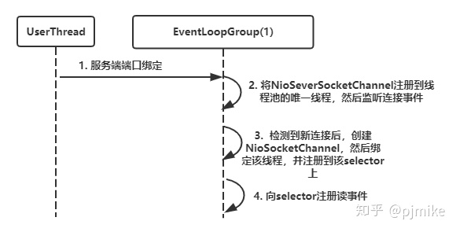
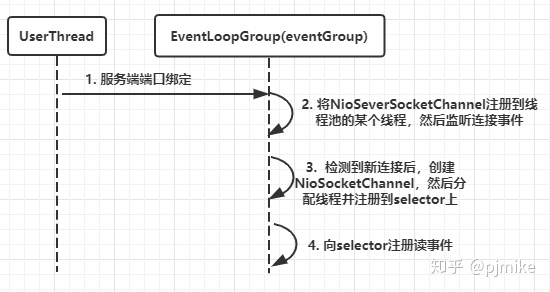
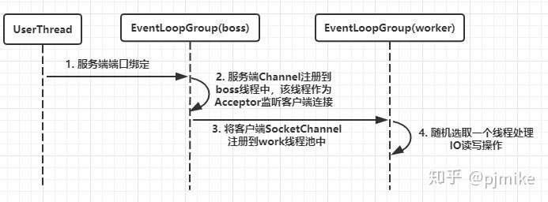

**IO模型**

- BIO：同步阻塞IO模型；
- NIO：基于IO多路复用技术的“非阻塞同步”IO模型。简单来说，内核将可读可写事件通知应用，由应用主动发起读写操作；
- AIO：非阻塞异步IO模型。简单来说，内核将读完成事件通知应用，读操作由内核完成，应用只需操作数据即可；应用做异步写操作时立即返回，内核会进行写操作排队并执行写操作。

NIO和AIO不同之处在于应用是否进行真正的读写操作。

**reactor和proactor模型**

- reactor：基于NIO技术，可读可写时通知应用；
- proactor：基于AIO技术，读完成时通知应用，写操作应用通知内核。

## netty线程模型

> netty的线程模型是基于Reactor模型的。
>
> 核心原理：Selector负责监听I/O事件，在监听到IO事件后，分发给相关线程处理

## **Reactor线程模型**

实际上Netty线程模型就是Reactor模式的一个实现，而Reactor模式又是什么呢？

Reactor模式是基于事件驱动开发的，核心组成部分包括Reactor和线程池，其中Reactor负责监听和分配事件，线程池负责处理事件，而根据Reactor的数量和线程池的数量，又将Reactor分为三种模型:

- 单线程模型 (单Reactor单线程)(固定大小为1的线程池)
- 多线程模型 (单Reactor多线程)
- 主从多线程模型 (多Reactor多线程)(一般是主从2个Reactor)

##### 单线程模型


- Reactor内部通过**selector** 监控连接事件，收到事件后通过**dispatch**进行分发，
- 如果是==连接建立的事件==，则由Acceptor处理，**Acceptor**通过accept接受连接，并创建一个Handler来处理连接后续的各种事件。
- 如果是==读写事件==，Reactor会分发给对应的**Handler**来处理
- **Handler完成read->(decode->compute->encode)->send的业务流程**
- 这个过程中，无论是事件监听、事件分发、还是事件处理，都始终只有 一个线程 执行所有的事情。
- 这种模型好处是简单，坏处却很明显，当某个Handler阻塞时，会导致其他客户端的handler和accpetor都得不到执行，无法做到高性能，只适用于业务处理非常快速的场景，有性能瓶颈。

##### 单Reactor，多线程模型


- Reactor线程中，Reactor对象通过selector监控连接事件,收到事件后通过dispatch进行分发，如果是连接建立事件，则由Acceptor处理，Acceptor通过accept接收连接，并创建一个Handler来处理后续事件，而Handler只负责响应事件，不进行业务操作，也就是只进行read读取数据和write写出数据，业务处理交给==一个线程池==进行处理
- 线程池分配一个线程完成真正的业务处理，然后将响应结果交给主进程的Handler处理，Handler将结果send给client (下面是核心代码)

==这种模型和第一种模型的主要区别是把业务处理从之前的单一线程脱离出来，换成线程池处理。（执行Handler逻辑的线程隶属于一个线程池）==

单Reactor承当所有事件的监听和响应,而当我们的服务端遇到大量的客户端同时进行连接，或者在请求连接时执行一些耗时操作，比如身份认证，权限检查等，这种瞬时的高并发就容易成为性能瓶颈（单Reactor成为瓶颈）

##### **主从Reactor多线程模型 （最流行）**

为了充分利用多核能力，可以构建两个 Reactor，这就演进为 「主从Reactor线程模型」 。


- 存在多个Reactor，**每个Reactor都有自己的selector选择器**，线程和dispatch
- 主Reactor线程中的mainReactor通过自己的selector监控连接建立事件，收到事件后通过Accpetor接收，将新的连接分配给某个子线程（==主Reactor只负责监听连接建立事件==）
- 子Reactor线程中的subReactor将mainReactor分配的连接加入连接队列中通过自己的selector进行监听，并创建一个Handler用于处理后续事件(==子Reactor只负责监听读写事件==)
- Handler完成read->业务处理->send的完整业务流程

## **Netty中的线程模型与Reactor的联系**

Netty主要靠NioEventLoopGroup线程池来实现具体的线程模型的

### **单线程模型**

单线程模型就是只指定一个线程执行客户端连接和读写操作，也就是在一个Reactor中完成，对应在Netty中的实现就是将NioEventLoopGroup线程数设置为1，核心代码是：

```text
 NioEventLoopGroup group = new NioEventLoopGroup(1);
        ServerBootstrap bootstrap = new ServerBootstrap();
        bootstrap.group(group)
                .channel(NioServerSocketChannel.class)
                .channel(NioServerSocketChannel.class)
                .option(ChannelOption.TCP_NODELAY, true)
                .option(ChannelOption.SO_BACKLOG, 1024)
                .childHandler(new ServerHandlerInitializer());
```

它的工作流程大致如下：



上述单线程模型就对应了Reactor的单线程模型

### **多线程模型**

多线程模型就是在一个单Reactor中进行客户端连接处理，然后业务处理交给线程池，核心代码如下：

```text
NioEventLoopGroup eventGroup = new NioEventLoopGroup();
ServerBootstrap bootstrap = new ServerBootstrap();
bootstrap.group(eventGroup)
        .channel(NioServerSocketChannel.class)
        .option(ChannelOption.TCP_NODELAY, true)
        .option(ChannelOption.SO_BACKLOG, 1024)
        .childHandler(new ServerHandlerInitializer());
```

走进group方法可以发现我们平时设置的bossGroup和workerGroup就是使用了同一个group

```text
@Override
public ServerBootstrap group(EventLoopGroup group) {
    return group(group, group);
}
```

工作流程如下：



### **主从多线程模型 (最常使用)**

主从多线程模型是有多个Reactor，也就是存在多个selector，所以我们定义一个bossGroup和一个workGroup，核心代码如下：

```text
NioEventLoopGroup bossGroup = new NioEventLoopGroup();
NioEventLoopGroup workerGroup = new NioEventLoopGroup();
ServerBootstrap bootstrap = new ServerBootstrap();
bootstrap.group(bossGroup,workerGroup)
        .channel(NioServerSocketChannel.class)
        .option(ChannelOption.TCP_NODELAY, true)
        .option(ChannelOption.SO_BACKLOG, 1024)
        .childHandler(new ServerHandlerInitializer());
```

工作流程如下：



**注意：其实在Netty中，bossGroup线程池最终还是只会随机选择一个线程用于处理客户端连接，与此同时，NioServerSocetChannel绑定到bossGroup的线程中，NioSocketChannel绑定到workGroup的线程中**

### EventLoop、EventLoopGroup 怎么实现Reactor线程模型?

上面我们已经了解了Reactor线程模型，了解了它的核心就是：

- Reactor线程模式 = Reactor(I/O多路复用)+ 线程池

它的运行模式包括四个步骤：

- 连接注册：建立连接后，将channel注册到selector上
- 事件轮询：selcetor上轮询(select()函数)获取已经注册的channel的所有I/O事件(多路复用)
- 事件分发：把准备就绪的I/O事件分配到对应线程进行处理
- 事件处理：每个worker线程执行事件任务


### EventLoop是什么

EventLoop 不是Netty独有的，它本身是一个通用的 事件等待和处理的程序模型。主要用来解决多线程资源消耗高的问题。例如 Node.js 就采用了 EventLoop 的运行机制。

那么，在Netty中，EventLoop是什么呢?

- 一个Reactor模型的事件处理器。
- 单独一个线程。
- 一个EventLoop内部会维护一个selector和一个「taskQueue任务队列」，分别负责处理 「I/O事件」 和 「任务」。

「taskQueue任务队列」是多生产者单消费者队列，在多线程并发添加任务时，可以保证线程安全。

「I/O事件」即selectionKey中的事件，如accept、connect、read、write等;

「任务」包括 普通任务、定时任务等。

- 普通任务：通过 NioEventLoop 的 execute() 方法向任务队列 taskQueue 中添加任务。例如 Netty 在写数据时会封装 WriteAndFlushTask 提交给 taskQueue。
- 定时任务：通过调用 NioEventLoop 的 schedule() 方法向 定时任务队列 scheduledTaskQueue 添加一个定时任务，用于周期性执行该任务(如心跳消息发送等)。定时任务队列的任务 到了执行时间后，会合并到 普通任务 队列中进行真正执行。


EventLoop单线程运行，循环往复执行三个动作：

- selector事件轮询
- I/O事件处理
- 任务处理


### EventLoopGroup是什么

EventLoopGroup比较简单，可以简单理解为一个“EventLoop线程池”。 


Tips：

监听一个端口，只会绑定到 BossEventLoopGroup 中的一个 Eventloop，所以， BossEventLoopGroup 配置多个线程也无用，除非你同时监听多个端口。


## Netty线程模型

在Reactor模型基础上，进行了一些修改。

1.Boss Group 进行监听连接建立事件

2.work Group 处理真正的读写请求事件


# 零拷贝

