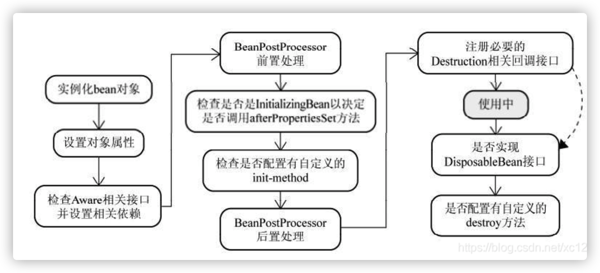

## spring源码

### 一、IOC模块：组件注册

1.原始方式，是通过配置xml配置文件，写bean类。使用如下**ClassPathXmlApplicationContext**获取类。

```
ApplicationContext ac = new ClassPathXmlApplicationContext("applicationContext.xml");  
RegisterDAO registerDAO = (RegisterDAO)ac.getBean("RegisterDAO");  
```

2.注解方式，通过@**Configuration+@Bean**的方式。其中**@Scope**可以配置单例(只需一份实例)还是多例(适用于并发环境，但其实我们还是更倾向于使用代码控制并发)，request还是session。区别：单例在spring启动时，不管调不调用直接进入spring容器(因为是单实例嘛，所以干脆直接加入了，默认不是懒加载，但是可以全局设置)。而多例只在使用时才加入，且每次使用都会初始化一个新的类。

由此才有了**@Lazy**去懒加载，保证默认的单例不会加入容器，只有使用时才会。

```
ApplicationContext ctx = new AnnotationConfigApplicationContext(AppConfig.class);
        //ctx.register(AppConfig.class);相当于读哪份配置文件
        ctx.refresh();
        Entitlement ent = (Entitlement)ctx.getBean("entitlement");
```

重点：**@Component**主要注入自己写的类交给spring管理，**@**Bean注入第三方包交给spring管理。

但是实际上对于无参的第三方包可以直接通过**@import**(类.class)导入，方便多了

3.包扫描作用：让**@Component，@Controller**这些注解自动注入spring管理，并且自动装配。否则得用application对象完成这些操作。

同样的，xml需要有一句话配置，注解也需要有个注解。**@ComponentScan**

@**ComponentScan**(里面的确还有很多配置，比如扫描的包，去除和只包含哪些)其实注解里面方法就是这样配置 方法名=""

```
@ComponentScan(value = "com.nrsc.springstudy.c1_componentscan1.study2.config2_test",
        includeFilters = {
                @Filter(type = FilterType.ANNOTATION, classes = {Component.class})},
        useDefaultFilters = false)
```

总结：

1.配置的所有@Component等注解，spring不能主动进行管理。所以得要我们告诉他哪些需要管理，所以才有了@ComponentScan。


### 二、生命周期 

可自定义bean的初始化和销毁。@Bean（initMethod= ,destoryMethod=）

##### 1.通过@Bean注解中配置初始化和销毁的方法。(单例是执行初始化和销毁的方法。但是多例是不会调用销毁方法，spring要求自己销毁)

##### 2.通过bean实现接口initializingBean，afterPropertieset()方法定义初始化，通过实现DisposableBean接口，destory()定义销毁方法。

(Timing:对象创建并赋值之后)

##### 3.@PostConstruct配置初始化，@PreDestory配置销毁(非spring注解，但是也有初始化的功能)

(Timing:对象创建并赋值之后)

##### 4.bean的后置处理器beanPostProcessor接口。postProcessBeforeInitialization，postProcessAfterInitialization

(Timing:对象创建并赋值之后，在其他任何初始化调用之前，在初始化调用之后。初始化前后。作用：在bean初始化前后完成操作)

spring bean的初始化执行顺序：Constructor(构造方法) -> @Autowired(依赖注入)  --> `@PostConstruct`注解的方法 --> `afterPropertiesSet`方法 --> `init-method`指定的方法


**注：1.spring底层用beanPostProcessor也用的非常多。2.必须在对象装配完属性之后**

大概过程：

1. 实例化 Instantiation
2. 属性赋值 Populate
3. 初始化 Initialization
4. 销毁 Destruction


1. bean实例化

   ```
   finishBeanFactoryInitialization
   getBean（就是doGetBean，只是一层包装）
   doGetBean 
   getSingleton
   createBean
   doCreateBean(包含了populateBean，initializeBean的全过程，即使通过这个方法来完成后面的方法)
   以下是2,3,4是docreateBean中的执行方法。
   ```

2. createBeanInstance 通过bean的name得到一个BeanWrapper，通过这个调用getWrappedInstance就可以得到我们要的bean。

3. 属性赋值 Populate  populateBean() -> 属性赋值 (AutowiredAnnotationBeanPostProcessor，一般是这个进行属性装配)

4. 如果Bean实现了BeanNameAware接口的话，Spring将Bean的Id传递给setBeanName()方法

5. 如果Bean实现了BeanFactoryAware接口的话，Spring将调用setBeanFactory()方法，将BeanFactory容器实例传入

6. 如果Bean实现了ApplicationContextAware接口的话，Spring将调用Bean的setApplicationContext()方法，将bean所在应用上下文引用传入进来。(获取容器当然要在前面)

7. 初始化 Initialization  initializeBean() -> 初始化 （上面的4种方法都是围绕这个）

   initializeBean的过程如下:

   ```
   applyBeanPostProcessorsBeforeInitialization 遍历取出所有的beanPostProcessor，进行执行相应的前置处理
   invokeInitMethods 初始化方法(就是我们定义的前几种初始化的方法，
   执行顺序为 @PostConstruct注解(非spring注解)  -->  initializingBean的afterPropertiesSet  -->  @Bean的init-method
   )
   applyBeanPostProcessorsAfterInitialization  遍历取出所有的beanPostProcessor，进行执行相应的后置处理
   ```

   (这里注意：后置处理是在初始化里，并不在销毁中)

8. 销毁 Destruction

```
销毁方法
(执行顺序为 @PreDestory注解 -->  DisposableBean的destory -->  @Bean的destoryMethod)
```



### bean的赋值(@value)，注入其他组件(实现xxxAware所有接口)，@Autowired(AutowiredAnnotationBeanPostProcessor,其实查看源码可以发现，他还支持@value，@autowired，@inject)，生命周期注解功能(@PostConstruct属于InitDestroyAnnotationBeanPostProcessor).....等等功能，都是beanPostProcessor的实现类实现的。

### 三、快速获取application对象

1.实现Spring的ApplicationContextAware接口，重写setApplicationContext方法，将得到的ApplicationContext对象保存到一个静态变量中，有了这个上下文对象，就可以在项目的任意地方用它来得到任意Bean;

2.直接注入对象

```
 @Autowired
 private ApplicationContext applicationContext;
```


### 四、属性赋值（AutowiredAnnotationBeanPostProcessor）

1.@Vlaue(${})：取出配置文件中的值(可以指定读取配置)。@Vlaue(#{})：使用Spel表达式取值	

2.@Autoired：默认是按类型去容器中找组件。如果找到多个，默认按属性名作为id。加上@Qualifer可以直接指定名字。默认必须装配成功，装配失败则报错。当然里面也有属性可以配置。@Autowired(required =false)

3.@Resource java规范注解，仅提供按名称注入。

4.@Inject  java规范注解额，需要额外导包，和@Autoired效果一样。但是不支持required。

重点介绍：@Autoired

作用域：@Target({ElementType.CONSTRUCTOR, ElementType.METHOD, ElementType.PARAMETER, ElementType.FIELD, ElementType.ANNOTATION_TYPE})

即可以加到构造器，方法，属性等上。

```
@Autoired//加在方法上，传入的参数从容器中拿。加在参数上也是一样。用构造器也是这样，但是对于只有一个有参构造器，可以省略注解
public void setCar(Car car){
		this.car=car;
}
```

### 5.获取spring底层组件，实现XXXAware接口。(Aware类型的接口可以得到很多spring的组件)

如：ApplicationContextAware，BeanFactoryAware等。也不难，在实现这些接口，都会要求重写set方法，底层无非就是通过判断当前类是否实现了XXXAware，如果是，则调用刚才实现的set方法进行注入。

底层依赖ApplicationContextAwareProcessor，是BeanPostProcessor的实现类。所以对于获得spring底层组件的类基本都是利用了BeanPostProcessor，且多以XXXAware结尾。并在postProcessBeforeInitialization中进行判断是否是ApplicationContextAware类(里面还判断是否其他类，如上下文环境等)，如果是，则赋值applicationContext。

对于这类方法必定会有一个setxxxxx（）方法。用于注入对象。

### 五、AOP

JoinPoint这个参数必须写参数表的第一位，写在后面无法生效。

1.写切面记得用@Aspect。

2.在切面的通知方法中必须标注注解，并写切入点表达式。

##### 3.开启aop注解模式@EnableAspectJAutoProxy，不然上面注解都不能生效。

源码：@EnableAspectJAutoProxy做了哪些事？

通过导入@Import(==AspectJAutoProxyRegistrar.class==)，这个类创建一个自动代理创建器AnnotationAwareAspectJAutoProxyCreator。

可以发现最后还是实现了BeanPostProcessor接口和Aware接口。

到此为止@EnableAspectJAutoProxy给容器中添加了internalAutoProxyCreator的BeanDefinition组件

internalAutoProxyCreator中实际又是AnnotationAwareAspectJAutoProxyCreator这个类

所以我们可以得出AnnotationAwareAspectJAutoProxyCreator就是实现AOP的核心组件

(AnnotationAwareAspectJAutoProxyCreator实现了一系列后置处理器)


# 代理

### jdk代理:

java动态代理是利用反射机制生成一个实现代理接口的匿名类，在调用具体方法前调用InvokeHandler来处理。

JDK动态代理只能对实现了接口的类生成代理，而不能针对类.

实现: 

```
public class TransactionHandler implements InvocationHandler {

    //需要代理的目标对象
    //这里设计为可以为任意对象添加事务控制, 所以将目标对象声明为Object
    private Object target;

    //构造TransactionHandler时传入目标对象
    public TransactionHandler(Object target) {
        this.target = target;
    }

    @Override
    public Object invoke(Object proxy, Method method, Object[] args) throws Throwable {
        //调用目标方法前的处理
        System.out.println("开启事务控制...");
        //调用目标对象的方法
        Object result = method.invoke(target, args);
        //调用目标方法后的处理
        System.out.println("关闭事务控制...");
        //放回方法调用结果
        return result;
    }

}
---------------------------------------------------------------------------
public class Main {

    public static void main(String[] args) {

        //新建目标对象
        Object target = new UserDaoImpl();

        //创建事务处理器
        TransactionHandler handler = new TransactionHandler(target);

        //生成代理类并使用接口对其进行引用
        UserDao userDao = (UserDao)Proxy.newProxyInstance(target.getClass().getClassLoader(),
                                                          target.getClass().getInterfaces(),
                                                          handler);
        //针对接口进行方法调用
        userDao.save();

    }

}
```

**Proxy.newProxyInstance()方法得到的是代理类，即上面的UserDao，虽然看上去是普通类，其实是代理类**

**前面两个参数，就是确定这个类是什么类型的。因为是动态代理，所以得到的代理类是动态改变的咯。**

**后面的handler，这是生成这个代理类的关键，他决定了方法调用前后执行什么方法。**

**handler这个类实现InvocationHandler接口，实现invoke方法，这里面决定了方法执行前后执行的代码。**

### cglib:

cglib动态代理是对代理对象类的class文件加载进来，通过修改其字节码生成子类来处理。CGLIB是针对类实现代理，主要是对指定的类生成一个子类，覆盖其中的方法,因为是继承，所以该类或方法最好不要声明成final .


# 注解

注解使用:

1  认识注解(Annotation)
注解相当于一种标记，在程序中加了注解就等于为程序打上了某种标记，没加，则等于没有某种标记。

以后，javac编译器、开发工具和其他程序可以用反射来了解你的类及各种元素上有无何种标记，看你有什么标记，就去干相应的事。

注解可以加在包，类，字段，方法，方法的参数以及局部变量上。

注解的存在不影响程序的编译和执行。

javac编译器看到注解，就会去做相应的动作。

 

注解是JDK1.5的新特性。

一个注解就是一个类，使用注解，就相当于创建了一个对象。


2  注解的分类
注解按照使用的方式和用途，注解可以分为三大类。

（1）内建注解。

          内建注解也称为基本注解，位于java.lang包下。
    
          内建注解有三个：
    
          1，检验重写父类方法：@Override
    
          2，标识方法已经过时：@Deprecated
    
          3，取消编译器警告：@SurppressWarnings

（2）元注解。

          元注解就是在注解上添加的注解。
    
          位置：元注解位于java.lang.annotation子包中。
    
          作用：用于修饰其他注解。
    
          元注解有四个：
    
         @Retention，@Target，@Documented，@Inherited。

（3）自定义注解。

         需要用到关键字@interface来定义。

3  注解的生命周期
注解的生命周期有三种，注解驻留在源文件阶段，字节码文件阶段和内存字节码阶段。

（1）注解被保留到源文件阶段

           当javac把.java源文件编译成.class时，就将相应的注解去掉。这种注解的生命周期就维持到源文件阶段。

（2）注解被保留到字节码文件阶段

          在JVM通过ClassLoader向内存中加载字节码文件时候，JVM会去掉相应的注解。这种注解的生命周期就维持到字节码文件阶段。

注意：生命周期到源文件阶段和字节码文件阶段的注解，由于JVM执行内存中的字节码时候，相应的注解已经被Javac或者JVM去除，所以无法使用反射来访问相应的注解。

（3）注解被保留到内存中的字节码阶段

         JVM运行内存的字节码时候，仍然可能会保留并且执行的某些注解。这种注解的生命周期就维持到内存字节码阶段。
    
         注意：这个阶段，程序可以通过反射访问生命周期到内存字节码阶段的注解。

 


三个阶段简单表示为：java源文件-->class文件-->内存中的字节码

@Retention(RetentionPolicy.RUNTIME) *//此注解运行到内存时才消除*

@Target({ElementType.METHOD,ElementType.TYPE}) *//此注解可修饰方法和类*

public @interface MyAnnotation {}

#### 除了通过AOP拿注解，普通的类也可以拿到注解

```
						Reflections f = new Reflections(SCAN_PACKAGE);
            Set<Class<?>> classSet = f.getTypesAnnotatedWith(ComputeElemType.class);
            classSet.forEach(clazz -> {
                try {
                    Integer v = clazz.getAnnotation(ComputeElemType.class).elem().getValue();
                    statisticsElemMap.put(v, (Statistics) clazz.newInstance());
                } catch (Exception e) {
                    log.error("算子初始化异常:{}", e);
                }
            });	
```


# 常用注解


# 拦截器&过滤器

拦截器，过滤器filter

1.首先是filter使用(总是忘记)

filter使用非常简单，写一个类实现FIlter接口。实现重写doFIlter方法，因为filter是基于servlet的，所以他能利用的参数无非就是request和response了。所以里面做的事就是利用这两个参数进行工作。最后filterchain.doFIlter()

相当于放行执行下一个filter。如果不想放行直接return。

2.那filter拦截的到底是什么？

他和拦截器不同，拦截器只拦截普通请求路径。filter几乎什么都拦截，包括静态资源。

3.怎么配置拦截路径，拦截器顺序呢？

以前都是在xml文件里配置，现在可以使用@Configuration注解中配置@Bean类完成filter配置。在里面配置拦截的路径。拦截器顺序：可进行配置顺序。

当然也可以不需要配置，直接使用注解进行配置，所有属性都可以用注解配置的。

2.拦截器使用：

1.实现HandlerInterceptor接口，重写三个方法。

preHandle按拦截器定义顺序调用：实现处理器的预处理（如登录检查返回值是boolean），如果为true，执行下个拦截器preHandle方法。第三个参数为响应的处理器（如具体的Controller实现）； (Controller之前执行)

postHandler按拦截器定义逆序调用：返回值是void，在Controller方法执行完，返回视图(渲染)之前执行，，此时我们可以通过modelAndView（模型和视图对象）对模型数据进行处理或对视图进行处理。

afterCompletion按拦截器定义逆序调用：整个请求处理完毕回调方法，即在视图渲染完毕时回调，主要进行资源回收，统一日志处理，统一异常处理等。

执行顺序：

1、当俩个拦截器都实现放行操作时，顺序为preHandle 1，preHandle 2，postHandle 2，postHandle 1，afterCompletion 2，afterCompletion 1

2、当第一个拦截器preHandle返回false，也就是对其进行拦截时，第二个拦截器是完全不执行的，第一个拦截器只执行preHandle部分。

3、当第一个拦截器preHandle返回true，第二个拦截器preHandle返回false，顺序为preHandle 1，preHandle 2 ，afterCompletion 1(即postHandle方法需要前面所有的preHandle方法都必须通过，而afterCompletion只要preHandle执行了，它必执行)

```
@Override
    public boolean preHandle(HttpServletRequest httpServletRequest, HttpServletResponse httpServletResponse, Object o) throws Exception {
        StringBuffer requestURL = httpServletRequest.getRequestURL();
        System.out.println("前置拦截器1 preHandle： 请求的uri为："+requestURL.toString());
        return true;
    }
    @Override
    public void postHandle(HttpServletRequest httpServletRequest, HttpServletResponse httpServletResponse, Object o, ModelAndView modelAndView) throws Exception {
        System.out.println("拦截器1 postHandle： ");
    }
    @Override
    public void afterCompletion(HttpServletRequest httpServletRequest, HttpServletResponse httpServletResponse, Object o, Exception e) throws Exception {
        System.out.println("拦截器1 afterCompletion： ");
    }
```

2.使用@Configurgtion实现 WebMvcConfigurer注入拦截器，配置拦截路径和顺序。

3.拦截器，过滤器filter和AOP区别：

filter：

Spring中自定义过滤器（Filter）一般只有一个方法，返回值是void，当请求到达web容器时，会探测当前请求地址是否配置有过滤器，有则调用该过滤器的方法（可能会有多个过滤器），然后才调用真实的业务逻辑，至此过滤器任务完成。过滤器并没有定义业务逻辑执行前、后等，仅仅是请求到达就执行。
拦截器：

拦截器有三个方法，相对于过滤器更加细致，有被拦截逻辑执行前、后等。Spring中拦截器有三个方法：preHandle，postHandle，afterCompletion

AOP:使用很简单。@Aspect(切面)+@Pointcut(切入点)+@Before(配置前置，后置)

面向切面拦截的是类的元数据（包、类、方法名、参数等）

相对于拦截器更加细致，而且非常灵活，拦截器只能针对URL做拦截，而AOP针对具体的代码，能够实现更加复杂的业务逻辑。


# 循环依赖

什么是循环依赖？

循环依赖其实就是循环引用，也就是两个或者两个以上的bean互相持有对方，最终形成闭环。比如A依赖于B，B依赖于C，C又依赖于A。如下图：

​	注意，这里不是函数的循环调用，是对象的相互依赖关系。循环调用其实就是一个死循环，除非有终结条件。

两种循环依赖情况：

1.构造方法依赖:public A(B b);

2.filed属性依赖 publlic void setB(B b);

两者区别：

1.构造方法必须在实例化的时候就要设置B

2.属性依赖可以不用那么急着去设置B，当然也要设置啊，毕竟是A的属性，没有这个属性也就不完整了。

怎么解决？

这里面其实构造方法的循环依赖没法解决，只能拋出BeanCurrentlyInCreationException异常，只能解决属性循环依赖，spring采用的是提前暴露对象的方法。

还记得Bean的生命周期吗？

开始三步:

1.bean构造实例化

2.setter方法属性注入

3.进行初始化(调用init方法)

从上面单例bean的初始化可以知道：循环依赖主要发生在第一、二步，也就是构造器循环依赖和field循环依赖。那么我们要解决循环引用也应该从初始化过程着手，对于单例来说，在Spring容器整个生命周期内，有且只有一个对象，所以很容易想到这个对象应该存在Cache中，Spring为了解决单例的循环依赖问题，使用了**三级缓存**。

这三级缓存分别指： 

singletonFactories ： 单例对象工厂的cache 

earlySingletonObjects ：提前暴光的单例对象的Cache 

singletonObjects：单例对象的cache

​	在创建bean的时候，首先想到的是从cache中获取这个单例的bean，这个缓存就是singletonObjects。如果获取不到，并且对象正在创建中，就再从二级缓存earlySingletonObjects中获取。如果还是获取不到且允许singletonFactories通过getObject()获取，就从三级缓存singletonFactory.getObject()(三级缓存)获取，如果获取到了则：从singletonFactories中移除，并放入earlySingletonObjects中。其实也就是从三级缓存移动到了二级缓存。

从上面三级缓存的分析，我们可以知道，Spring解决循环依赖的诀窍就在于singletonFactories这个三级cache。这个cache的类型是ObjectFactory。这里就是解决循环依赖的关键，发生在createBeanInstance之后，也就是说单例对象此时已经被创建出来(调用了构造器)。这个对象已经被生产出来了，虽然还不完美（还没有进行初始化的第二步和第三步），但是已经能被人认出来了（根据对象引用能定位到堆中的对象），所以Spring此时将这个对象提前曝光出来让大家认识，让大家使用。

这样做有什么好处呢？让我们来分析一下“A的某个field或者setter依赖了B的实例对象，同时B的某个field或者setter依赖了A的实例对象”这种循环依赖的情况。A首先完成了初始化的第一步，并且将自己提前曝光到singletonFactories中，此时进行初始化的第二步，发现自己依赖对象B，此时就尝试去get(B)，发现B还没有被create，所以走create流程，B在初始化第一步的时候发现自己依赖了对象A，于是尝试get(A)，尝试一级缓存singletonObjects(肯定没有，因为A还没初始化完全)，尝试二级缓存earlySingletonObjects（也没有），尝试三级缓存singletonFactories，由于A通过ObjectFactory将自己提前曝光了，所以B能够通过ObjectFactory.getObject拿到A对象(虽然A还没有初始化完全，但是总比没有好呀)，B拿到A对象后顺利完成了初始化阶段1、2、3，完全初始化之后将自己放入到一级缓存singletonObjects中。此时返回A中，A此时能拿到B的对象顺利完成自己的初始化阶段2、3，最终A也完成了初始化，进去了一级缓存singletonObjects中，而且更加幸运的是，由于B拿到了A的对象引用，所以B现在hold住的A对象完成了初始化。

知道了这个原理时候，肯定就知道为啥Spring不能解决“A的构造方法中依赖了B的实例对象，同时B的构造方法中依赖了A的实例对象”这类问题了！因为加入singletonFactories三级缓存的前提是执行了构造器，所以构造器的循环依赖没法解决。

**(总结:无非就是将实例化和set属性这两个过程分开来，如果A实例化了，调用构造方法，那么就将这个对象暴露出来(放进map中)，虽然此时他的属性还不完整，没关系啊有总比没有好吧，此时实例化另一个对象B，发现依赖了前一个对象，则进行注入，完成了初始化。此时A发现了B已经初始化完成，那么他也将B注入成功了。)**

**基于构造器的循环依赖**

Spring容器会将每一个正在创建的Bean 标识符放在一个“当前创建Bean池”中，Bean标识符在创建过程中将一直保持在这个池中，因此如果在创建Bean过程中发现自己已经在“当前创建Bean池”里时将抛出BeanCurrentlyInCreationException异常表示循环依赖；而对于创建完毕的Bean将从“当前创建Bean池”中清除掉。

Spring容器先创建单例A，A依赖B，然后将A放在“当前创建Bean池”中，此时创建B,B依赖C ,然后将B放在“当前创建Bean池”中,此时创建C，C又依赖A， 但是，此时A已经在池中，所以会报错，，因为在池中的Bean都是未初始化完的，所以会依赖错误 ，（初始化完的Bean会从池中移除）

#### **基于setter属性的单例Singleton循环依赖**

Spring先是用构造实例化Bean对象 ，创建成功后，Spring会通过以下代码提前将对象暴露出来，此时的对象A还没有完成属性注入，属于早期对象，此时Spring会将这个实例化结束的对象放到一个Map中，并且Spring提供了获取这个未设置属性的实例化对象引用的方法。 结合我们的实例来看，当Spring实例化了A、B、C后，紧接着会去设置对象的属性，此时A依赖B，就会去Map中取出存在里面的单例B对象，以此类推，不会出来循环的问题喽

#### setter方式原型，prototype(抛异常)

对于"prototype"作用域bean，Spring容器无法完成依赖注入，因为Spring容器不进行缓存"prototype"作用域的bean，因此无法提前暴露一个创建中的bean。

scope="prototype" 意思是 每次请求都会创建一个实例对象。两者的区别是：有状态的bean都使用Prototype作用域，无状态的一般都使用singleton单例作用域。

**结束语：**

不要使用基于构造函数的依赖注入，可以通过以下方式解决：

1.在字段上使用@Autowired注解，让Spring决定在合适的时机注入

2.用基于setter方法的依赖注入。


### 1.spring解决循环依赖

创建一个对象的过程，分为对象实例化和属性实例化。利用反射完成java对象实例化，先进行对象实例化，然后设置属性。

比如A 依赖于B，B依赖于A。(依赖注入，本质上就是set方法设置属性)。

解决循环依赖有两个前提条件

- 不全是构造器方式的循环依赖
- 必须是单例模式

  基于上面的问题，我们知道Bean的生命周期，本质上解决循环依赖的问题就是三级缓存，通过三级缓存提前拿到未初始化的对象

#### 过程：

A实例化时调用ApplicationContext.getBean()，此时会创建一个A对象，然后进行设置属性的时候发现依赖B，发现容器此时没有B对象，则调用ApplicationContext.getBean()方法实例化B。实例化B的时候创建了一个B对象，然后设置属性时发现依赖A。此时A对象和B对象都已经创建了，并且保存在Spring容器中了，只不过A对象的属性b和B对象的属性a都还没有设置进去。所以还是会去调用ApplicationContext.getBean()方法获取A对象的实例，虽然此时A还是个半成品，但是还是可以用的，所以返回给B了。ApplicationContext.getBean()方法递归返回，返回到A此时也就可以拿到B的对象注入了。

#### 源码过程：

当bean进行创建时，会先调用getbean方法->执行doGetBean方法，在doGetBean方法中会调用getSingleton方法，这一步就是从三级缓存中获取对象缓存，因为是刚开始创建bean所以缓存中肯定没有，之后会调用createBean方法，**createBean**创建实例，实例化完成放入三级缓存singletonFactories中，接着执行**populateBean**方法装配属性，但是发现有一个属性是B的对象。因此再次调用doGetBean方法创建B的实例，依次执行doGetBean、查询缓存、createBean创建实例，实例化完成之后放入三级缓存singletonFactories中，执行populateBean装配属性，但是此时发现有一个属性是A对象。因此再次调用doGetBean创建A的实例，但是执行到getSingleton查询缓存的时候，从三级缓存中查询到了A的实例(早期引用，未完成属性装配)，此时直接返回A。解决问题

**(解决本质：创建时调用getSingleton，此方法首先查看三级缓存是否存在对象，如果没有，创建实例存入三级缓存，之后才开始装配属性)(创建实例对象和装配属性是有明显界限的，正是因为创建实例后存入了三级缓存才能解决)**

#### 为什么Spring不能解决构造器的循环依赖？（只能解决依赖注入，set方式的循环依赖）

在Bean调用构造器实例化之前，一二三级缓存并没有Bean的任何相关信息，**在实例化之后才放入三级缓存中**，因此当getBean的时候缓存并没有命中，这样就抛出了循环依赖的异常了。


#### AB互相依赖问题

A对象的创建过程：

- 创建A对象，实例化的时候把A对象工厂放入三级缓存
- A注入属性时，发现依赖B，转而去实例化B
- 同样创建对象B，注入属性时发现依赖A，依次从一级到三级缓存中查询A，从三级缓存中通过对象工厂拿到A，把A放入到二级缓存中，同时删除三级缓存中的A，此时B已经实例化并且初始化完成，把B放入一级缓存。
- 接着继续创建A，顺利从一级缓存拿到实例化且初始化完成的B对象，A对象创建也完成，删除二级缓存中的A，同时把A放入一级缓存中
- 最后一级缓存中保存着实例化、初始化都完成的A、B对象

  因此由于把实例化和初始化的流程分开了，所以就解决了构造器不好解决的循环依赖

> 为什么要三级缓存，二级缓存不行吗
>
>   不可以，三级缓存的目的就是要生成代理对象。
>
>   因为三级缓存中放的是生成具体对象的匿名内部类，他可以生成代理对象，也可以是普通的实例对象。使用三级缓存是为了保证不管什么时候使用的都是一个对象。

### 2.一二三级缓存

一级：singletonObjects  所有单例的bean初始化完成后会存放在一个Map(**singletonObjects**)中，beanName为key，单例bean为value。(存放初始化完成的bean)

二级：earlySingletonObjects

三级：singletonFactories 如果支持循环依赖，则生成三级缓存，提前暴露bean。(说白了就是存个残次品的bean)

#### 三级缓存

- 一级缓存：用来保存实例化、初始化都完成的对象
- 二级缓存：用来保存实例化完成，但未初始化完成的对象
- 三级缓存：用来保存一个对象工厂，提供一个匿名内部类，用于创建二级缓存中的对象

## 思考：

一级缓存能解决单纯循环依赖问题吗？

能也能，让残次品的bean和完整的bean的都存入map中，那么key就要设置的不一样。显然不符合正常的思路。


二级缓存能解决单纯循环依赖问题吗？

能，一个放完成的bean，一个放残次品

# 面试题


- Spring Core：框架中最基础的部分，提供Ioc容器，对Bean进行管理
- Spring Context：基于bean，提供上下文信息，扩展出其他功能
- Spring DAO：提供JDBC的抽象层，可以消除冗长的JDBC编码，以及提供了声明式事务管理
- Spring ORM：提供常用的“对象/关系”映射APIs的集成层。包括JPA、JDO、Hibernate、MyBatis
- Spring AOP：提供面向切面的编程实现
- Spring Web：提供了基础的Web开发的上下文信息，可与其他Web进行集成
- Spring Web MVC：提供了Web应用的MVC全功能实现

Spring 核心容器 – 该层基本上是 Spring Framework 的核心。它包含以下模块：

- Spring Core
- Spring Bean
- SpEL (Spring Expression Language)
- Spring Context

数据访问/集成 – 该层提供与数据库交互的支持。它包含以下模块：

- JDBC (Java DataBase Connectivity)
- ORM (Object Relational Mapping)
- OXM (Object XML Mappers)
- JMS (Java Messaging Service)
- Transaction

Web – 该层提供了创建 Web 应用程序的支持。它包含以下模块：

- Web
- Web – Servlet
- Web – Socket
- Web – Portlet

**AOP** – 该层支持面向切面编程

**Instrumentation** – 该层为类检测和类加载器实现提供支持。

**Test** – 该层为使用 JUnit 和 TestNG 进行测试提供支持。

几个杂项模块:

- Messaging – 该模块为 STOMP 提供支持。它还支持注解编程模型，该模型用于从 WebSocket 客户端路由和处理 STOMP 消息
- Aspects – 该模块为与 AspectJ 的集成提供支持。


#### IOC容器有多少

- BeanFactory - BeanFactory 就像一个包含 bean 集合的工厂类。它会在客户端要求时实例化 bean。

- ApplicationContext - ApplicationContext 接口扩展了 BeanFactory 接口。它在 BeanFactory 基础上提供了一些额外的功能。

  - BeanFactory;

  - - 使用懒加载
    - 使用语法显示提供资源对象
    - 不支持国际化
    - 不支持基于依赖的注解

  - ApplicationContext

  - - 使用即时加载
    - 自己创建和管理资源对象
    - 支持国际化
    - 支持基于依赖的注解

  

Spring bean 支持 5 种 scope：

- Singleton - 每个 Spring IoC 容器仅有一个单实例。
- Prototype - 每次请求都会产生一个新的实例。
- Request - 每一次 HTTP 请求都会产生一个新的实例，并且该 bean 仅在当前 HTTP 请求内有效。
- Session - 每一次 HTTP 请求都会产生一个新的 bean，同时该 bean 仅在当前 HTTP session 内有效。
- Global-session - 类似于标准的 HTTP Session 作用域，不过它仅仅在基于 portlet 的 web 应用中才有意义。Portlet 规范定义了全局 Session 的概念，它被所有构成某个 portlet web 应用的各种不同的 portlet 所共享。在 global session 作用域中定义的 bean 被限定于全局 portlet Session 的生命周期范围内。如果你在 web 中使用 global session 作用域来标识 bean，那么 web 会自动当成 session 类型来使用。

spring bean 容器的生命周期流程如下：

1. Spring 容器根据配置中的 bean 定义中实例化 bean
2. Spring 使用依赖注入填充所有属性，如 bean 中所定义的配置。
3. 如果 bean 实现 BeanNameAware 接口，则工厂通过传递 bean 的 ID 来调用 setBeanName()。
4. 如果 bean 实现 BeanFactoryAware 接口，工厂通过传递自身的实例来调用 setBeanFactory()。
5. 如果存在与 bean 关联的任何 BeanPostProcessors，则调用 preProcessBeforeInitialization() 方法。
6. 如果为 bean 指定了 init 方法（的 init-method 属性），那么将调用它。
7. 最后，如果存在与 bean 关联的任何 BeanPostProcessors，则将调用 postProcessAfterInitialization() 方法。
8. 如果 bean 实现 DisposableBean 接口，当 spring 容器关闭时，会调用 destory()。
9. 如果为 bean 指定了 destroy 方法（的 destroy-method 属性），那么将调用它。


#### 什么是IOC

**Ioc意味着将你设计好的对象交给容器控制，而不是传统的在你的对象内部直接控制。控制权发生了反转，对象控制权交给了容器，**因为由容器帮我们查找及注入依赖对象，对象只是被动的接受依赖对象，所以是反转。****

容器：BeanFactory - BeanFactory 就像一个包含 bean 集合的工厂类。它会在客户端要求时实例化 bean。

 IoC 的实现原理就是工厂模式加反射机制。Fruit f=Factory.getInstance("io.github.dunwu.spring.Apple");


#### **有哪些不同类型的IOC（依赖注入）方式？**

- **构造器依赖注入：**构造器依赖注入通过容器触发一个类的构造器来实现的，该类有一系列参数，每个参数代表一个对其他类的依赖。
- **Setter方法注入：**Setter方法注入是容器通过调用无参构造器或无参static工厂 方法实例化bean之后，调用该bean的setter方法，即实现了基于setter的依赖注入。

- 自动装配方式

- - no：默认设置，表明没有自动装配。使用显式bean引用进行装配
  - byName：根据bean的名称注入对象依赖项
  - byType：根据类型注入对象依赖项
  - autodetect：首先容器尝试通过构造函数使用aytowire装配，如果不能，则尝试通过bytype自动装配

#### 什么是AOP

横向抽取取代传统纵向继承。AOP是处理一些横切行问题。这些横切性问题不会影响到主逻辑的实现。AOP就是把这些问题和主业务逻辑分开，达到与主业务逻辑解耦的目的。

默认的策略是如果目标类是接口，则使用JDK动态代理技术，否则使用Cglib来生成代理

Join point：连接点，例如:servlet中的longin()就是连接点；所以连接点在spring中它永远是一个方法。也可以说'目标对象中的方法就是一个连接点‘。JointPoint对象则包含了和切入相关的很多信息。比如切入点的对象，方法，属性等。我们可以通过反射的方式获取这些点的状态和信息，用于追踪tracing和记录logging应用信息。

pointcut：切点，就是连接点的集合！

Weaving：织入；指把增强应用到目标对象来创建新的代理对象的过程。Spring是在允许时完成织入的，这个过程叫做织入(Weaving)：

Advice：通知，就字面意思，但是有2个部分组成，通知内容和通知到哪里去。

通知类型:

Before ：前置通知，在连接点方法前调用

After ：后置通知，在连接点方法后调用

AfterReturning：返回通知，在连接点方法执行并正常返回后调用，要求连接点方法在执行过程中没有发生异常

AfterThrowing：异常通知，当连接点方法异常时调用

Around：环绕通知，它将覆盖原有方法，但是允许你通过反射调用原有方法。Proceedingjoinpoint 继承了 JoinPoint。是在JoinPoint的基础上暴露出 proceed 这个方法。proceed很重要，这个是aop代理链执行的方法。

**Aspect：切面**！包括连接点，切点，通知的一个载体。（如果用AspectJ它就是一个类，如果用springXML的时候它就是一个标签）并且交给spring管理。

Target object：目标对象，原始对象。

AOP proxy：代理对象， 包含了原始对象的代码和增强后的代码的那个对象。

Introduction：引入，声明额外的方法或者某个类型的字段。Spring允许引入新的接口道任何被代理的对象。


### Spring AOP和AspectJ AOP有什么区别

需要知道：

#### Spring AOP：

原本是使用一些xml配置进行配置的，这时跟AspectJ没有关系。但是如果使用了@AspectJ等注解，在开发中引入了`org.aspectj:aspectjrt:1.6.11`和`org.aspectj:aspectjweaver:1.6.11`两个包，这是因为Spring AOP使用了AspectJ的Annotation，使用了Aspect来定义切面,使用Pointcut来定义切入点，使用Advice来定义增强处理。虽然Spring AOP使用了Aspect的Annotation，但是并没有使用它的编译器和织入器。(所以只是使用了一些定义规范，并没有使用编译器等，所以还是运行时增强而不是编译增强)

#### AspectJ：

这是可以不依赖spring框架的，可以独立运行的。使用ajc命令编译java文件，ajc当成一个增强版的javac命令。**AspectJ在编译时“自动”编译得到了一个新类。**


Spring AOP也是对目标类增强，生成代理类。但是与AspectJ的最大区别在于——Spring AOP的运行时增强，而AspectJ是编译时增强。

- Spring AOP 是基于动态代理实现的，属于运行时增强，不需要单独编译，性能差一些

- - 默认如果使用接口的话使用JDK提供的动态代理实现，如果是方法则使用CGLIB实现

-   AspectJ则属于编译时增强，主要有三种方法：

- - 编译时织入：指的是增强的代码和源代码我们都有，直接使用AspectJ编译器编译即可，编译以后生成一个新的类，他会作为一个正常的Java类装载在JVM中
  - 编译后织入：指的是代码已经被编译成Class文件或者打包成jar包，这个时候要增强的话，就是编译后织入，比如当你依赖第三方的类库时，又需要对其增强的话，就可以使用这种方式
  - 加载时织入：指的是在JVM加载类的时候进行织入

- - JKD动态代理、

  - - JDK动态代理实现了InvocationHandler接口，重写的invoke方法
    
    - 其基础是反射机制，代理类调用invoke(Object proxy, Method method, Object[] args)，传入methdo引用反射调用
    
    - Proxy.newProxyInstance(clazz.getClassLoader(),clazz.getInterfaces(),this);生成代理类
    
    - 编译后生成一个代理类，类中维持着被代理对象所有的Method引用，通过调用invoke，传入对应的引用实现代理。
    
    - ```
         字节码重组过程
         1）获取被代理对象的引用，并且获取它的所有接口，反射获取。
       （2）JDK动态代理类重新生成一个新的类，同时新的类要实现被代理类实现的所有接口。
       （3）动态生成Java代码，新加的业务逻辑方法由一定的逻辑代码调用（在代码中体现）。
       （4）编译新生成的Java代码.class文件。
       （5）重新加载到JVM中运行。
      ```
    
  - CGlib**CGLIB是一个代码生成类库，可以在运行时候动态是生成某个类的子类**

  - - 使用字节码处理框架ASM，原理是通过字节码技术为一个类创建子类，并在子类中采用方法拦截的技术拦截所有父类方法的调用，顺势注入横切逻辑。
    - 实现MethodInterceptor接口和intercept方法(封装befor和after方法)
    - CGLib动态代理是通过==FastClass==机制直接调用方法的，CGLib动态代理的执行效率更高
    - 编译后查看源码可以发现生成了三个class文件，一个是代理类，另外两个是被代理类和代理类的FastClass类
    - FastClass机制，它的原理简单来说就是：为代理类和被代理类各生成一个类，FastClass可以直接定位要调用的方法并直接进行调用，省去了反射调用，因此调用效率比JDK代理通过反射调用高

- >   CGLib性能较高，但是在创建代理对象时花费时间较多，所以在单例模式下更加有优势
  >
  >   CGLib采用的是动态创建子类的方法，所以对于final方法无法代理
  >
  > JDK的动态代理只可以为接口去完成操作，而CGlib即可以为没有实现的接口的类做代理，也可以为实现接口的类去做代理

### Spring中用到哪些设计模式

- 工厂模式：BeanFactory就是简单工厂模式，用来创建对象的实例
- 单例模式：Bean默认为单例模式
- 代理模式：AOP功能中用到了JDK的动态代理
- 模板方式：主要是一些对数据库操作的类，
- 观察者模式：定义对象键一种一对多的依赖关系


### @Component和@Bean的区别

- 作用对象不同

- - @Component作用于类
  - @Bean作用于方法

- 作用

- - @Component通常是通过类路径来自动侦测以及自动装配到Spring容器中
  - @Bean注解通常是我们在标有该注解的方法中定义这个bean，@Bean告诉了Spring这是个类的实例。

- 另外@Bean注解自定义性更强，很多地方比如第三方库中的类需要装配到spring容器中的时候只能通过@Bean实现

#### Spring事务中的隔离级别有哪几种

TransactionDefinition接口中定义了五个表示隔离级别的常量。

- **ISOLATION_DEFAULT:** 后端数据库默认的隔离级别，Mysql 默认采用的 REPEATABLE_READ隔离级别 Oracle 默认采用的 READ_COMMITTED隔离级别.
- **ISOLATION_READ_UNCOMMITTED:** 最低的隔离级别，允许读取尚未提交的数据变更，**可能会导致脏读、幻读或不可重复读**
- **ISOLATION_READ_COMMITTED:** 允许读取并发事务已经提交的数据，**可以阻止脏读，但是幻读或不可重复读仍有可能发生**
- **ISOLATION_REPEATABLE_READ:** 对同一字段的多次读取结果都是一致的，除非数据是被本身事务自己所修改，**可以阻止脏读和不可重复读，但幻读仍有可能发生。**
- **ISOLATION_SERIALIZABLE:** 最高的隔离级别，完全服从ACID的隔离级别。所有的事务依次逐个执行，这样事务之间就完全不可能产生干扰，也就是说，**该级别可以防止脏读、不可重复读以及幻读**。但是这将严重影响程序的性能。通常情况下也不会用到该级别。

### @Transaction注解

  Java中的异常Exception分为运行时异常和非运行时异常。事务的管理对于企业应用来说是十分重要的，即使出现异常情况，可可以保证数据的一致性。

  当@Transaction注解作用于类上时，该类的所有public方法都具有该类型的事务属性。同时也可以在方法级别使用该标注来覆盖类级别的定义。

  类或者方法加了这个注解，那么这个类里面的方法抛出异常，就会回滚，数据库里面的数据也会回滚。

#### rollbackFor

  如果在@Transaction注解中不配置rollbackFor属性，那么事务只会在遇到RuntimeException的时候才会回滚，加上rollbackFor=Exception.class，可以让事务在遇到非运行时异常时也回滚


### 截器Interceptor与过滤器Filter的区别

拦截器和过滤器的区别

| 类型       | 过滤器Filter                                       | 拦截器interceptor                                            |
| ---------- | -------------------------------------------------- | ------------------------------------------------------------ |
| 规范       | Filter是在Servlet规范中定义的，是Servlet容器支持的 | 拦截器是在Spring容器内的，是Spring框架支持的                 |
| 使用范围   | 过滤器只能用于Web程序中                            | 拦截器既可以用于Web程序，也可以用于Application、Swing程序中  |
| 原理       | 过滤器是基于函数回调                               | 拦截器是基于java的反射机制                                   |
| 使用的资源 | 过滤器不能使用Spring资源                           | 拦截器是一个Spring的组件，归Spring管理，配置在Spring文件中，因此能使用Spring里的任何资源、对象，例如Service对象、数据源、事务管理等，可以通过loC注入到拦截器 |
| 深度       | Filter在只在Servlet前后起作用                      | 拦截器能够深入到方法前后、异常抛出前后等，因此拦截器的使用具有更大的弹性 |

**在Tomcat容器中，过滤器和拦截器触发时机不一样**，过滤器是在请求进入容器后，但请求进入servlet之前进行预处理的。请求结束返回也是，是在servlet处理完后，返回给前端之前。过滤器包裹住servlet，servlet包裹住拦截器。


