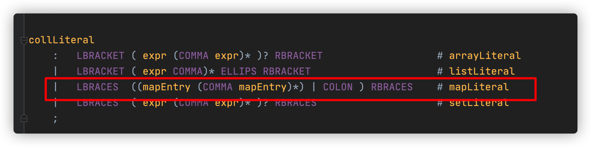
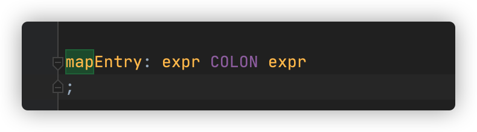

## ANTLR

根据[官网](https://www.antlr.org/)定义，ANTLR是一款强大的语法分析器生成工具，可用于`读取`、`处理`、`执行`或者`翻译`结构化文本或二进制文件。ANTLR根据语法，可以生成对应的语法分析器，并自动建立语法分析树（一种描述语法和输入文本匹配关系的数据结构），ANTLR能够自动生成分析器的遍历器，通过遍历器，用户可以方便地执行自定义的业务逻辑代码。


安装好ANTLR运行环境之后，我们来编写一个简单的`Hello World`程序来初步认识ANTLR。首先，需要创建一个`HelloWorld.g4`文件，文件内容如下：

```
grammar HelloWorld;         // 定义一个名为Hello的语法
r  : 'hello' ID ;           // 匹配一个关键字hello和一个紧随其后的标识符
ID : [a-z]+ ;               // 匹配小写字母组成的标识符
WS : [ \t\r\n]+ -> skip ;   // 忽略空格 、Tab、换行以及\r
```

语法名为`HelloWorld`，必须跟文件名保持一致。==语法规则==为`r`，必须为小写字母。`ID`和`WS`为==词法规则==，必须为大写字母。然后使用前文定义的`antlr4`命令来生成语法分析器和词法分析器：

```
# 生成语法分析器和词法分析器
antlr4 HelloWorld.g4
# 查看生成文件
ls
# HelloWorld.g4                   HelloWorld.tokens               HelloWorldLexer.interp          HelloWorldLexer.tokens          HelloWorldParser.java
# HelloWorld.interp               HelloWorldBaseListener.java     HelloWorldLexer.java            HelloWorldListener.java
# 编译生成的java文件
javac *.java
```

其中左图中的 stat、assign、expr 代表的是规则节点（RuleNode），对应着 ANTLR 语法定义中的规则名称，sp、100 对应的是终端节点（TerminalNode），也就是单词符号。相对应的，右图中的 StatContext、AssignContext、ExprContext 代表该节点的上下文信息，如节点名称、词法符号的开始和结束位置等。TerminalNode 也是类似，只不过代表的是叶子结点信息，没有子节点。实际上 Context 和 TerminalNode 都是一种 Tree 节点类型。


采用深度优先遍历，去遍历节点。


总结：所有规则最后都会被词法解析成一个树。那么实际这颗树怎么执行呢？有两种模式访问，监听器模式和访问者模式。这里只用访问者举例。


### 监听器模式

按照树的深度优先遍历依次访问每个节点，在进入和退出节点分别触发回调事件。这样开发者只需要实现进入和退出节点的逻辑而不需要关心树是如何遍历的。

(比如A节点下有BCD节点，遍历A时，不关心BCD的调用顺序(因为BCD是同层节点)，只关心进入和退出BCD时)


### 访问者模式

通过显式的方法调用来访问子节点，也就是将对要遍历的节点选择权交给开发者。

(比如A节点下有BCD节点，遍历A时，访问BCD的顺序怎么调整都行，但是BCD每个节点都需要生成访问方法，供A去自由组合调用)


1、这里定义了一条规则mapLiteral



2.使用antlrv4插件生成的类 ***BaseVisitor，含有visitMapLiteral方法，继承这个类和方法即可。且由于返回类型可以自由定义，这让程序返回值更加自由。

```
@Override public T visitMapLiteral(ChopperParser.MapLiteralContext ctx) { return visitChildren(ctx); }
```

3.对方法进行实现，可以看到mapLiteral节点下，有多个mapEntry节点规则。那怎么拿到这个节点的值呢？

==visit(ctx.mapEntry(i)),就可以拿到子节点的值。每个ctx都能拿到子节点的遍历方法，既然有遍历方法，就有visitMapEntry方法==

(这里对节点的遍历是为了生成java代码的字符串，当然也可以有其他的类型的遍历结果，取决你想得到这个节点干什么)

```
@Override
    public StringBuilder visitMapLiteral(ChopperParser.MapLiteralContext ctx) {

        StringBuilder sb = new StringBuilder();
        // empty map
         sb.append("new ChopperRuntimeJavaType");
         sb.append("(");
        if (ctx.mapEntry().isEmpty()) {
            sb.append("new HashMap<String, ChopperObject>()");
        } else {

            sb.append("Stream.of");
            sb.append("(");

            for (int i=0; i<ctx.mapEntry().size(); i++) {
                sb.append(visit(ctx.mapEntry(i)));
                if (i != ctx.mapEntry().size() - 1) {
                    sb.append(",");
                }
            }

            sb.append(")");  // Stream.of
            sb.append(".collect(Collectors.toMap(Map.Entry::getKey, Map.Entry::getValue))");
        }

         sb.append(")"); // new ChopperRuntimeJavaType

        return sb;
    }
```

4.visitMapEntry方法，这里是两个expr，所以实现里就有访问节点==visit(ctx.expr(0))==

```
    public StringBuilder visitMapEntry(ChopperParser.MapEntryContext ctx) {

        StringBuilder sb = new StringBuilder();
        sb.append("new AbstractMap.SimpleEntry<ChopperObject, ChopperObject>");
        sb.append("(");

        sb.append(visit(ctx.expr(0)));
        sb.append(",");
        sb.append(visit(ctx.expr(1)));

        sb.append(")");
        return sb;
    }
```



(综上：所以说访问者模式是灵活遍历节点)

